# CLAUDE.md — ระบบวัดระดับน้ำอัตโนมัติ (Node.js OOP · MVP)

เอกสารข้อกำหนดและการออกแบบระบบ สำหรับพัฒนาใหม่ด้วย **Node.js เชิงวัตถุ (OOP)**
อ้างอิงระบบเดิม (PHP) ทั้งหมดในโฟลเดอร์ `data/`

| หัวข้อ | ค่า |
|---|---|
| ภาษา | **JavaScript (ES2022) ล้วน** — ไม่มี TypeScript ไม่มีขั้นตอน build |
| รูปแบบ | **Object-Oriented Programming** — คลาส, การสืบทอด, การห่อหุ้ม, พหุสัณฐาน |
| Runtime | Node.js 20 LTS ขึ้นไป (ESM `"type": "module"`) |
| เว็บ | Express 4 + EJS (server-rendered) + vanilla JS |
| ฐานข้อมูล | **เลือกได้ 2 แบบ** — SQLite (โมดูล `node:sqlite` ในตัว ไม่ต้องมีเซิร์ฟเวอร์) หรือ MySQL 8 ผ่าน `mysql2/promise` |
| งานตามเวลา | `node-cron` ทำงานในโปรเซสเดียวกัน |
| ไฟล์ภาพ | ระบบไฟล์ของเครื่อง (`storage/images/`) |
| **ไม่ใช้** | Docker, Redis, S3/MinIO, ORM, monorepo, TypeScript |

> **สถานะ:** พัฒนาแล้ว — `data/` เป็นเอกสารอ้างอิงระบบเดิม (อ่านอย่างเดียว ห้ามแก้)
> **การรัน:** `npm install` → `npm start` → เปิด `/setup` เพื่อตั้งค่าผ่านหน้าเว็บ
> (หรือใช้บรรทัดคำสั่ง: ตั้งค่า `.env` → `npm run db:setup` → `npm run create:admin` → `npm start`)

---

## 1. ภาพรวมระบบ

ระบบตรวจวัด **ระดับน้ำอัตโนมัติจากภาพกล้องวงจรปิด** สำหรับหน่วยงานท้องถิ่น (ต้นแบบ: วัดเขียน อบต.บางไผ่)

1. กล้อง IP ส่งสตรีมภาพ (m3u8 / snapshot / mjpeg)
2. ผู้ดูแลกำหนด **ROI** (กรอบเสาวัดระดับ) และ **โซนเตือนภัย 6 ระดับ** ผ่านเครื่องมือวาดบน canvas
3. ตัวจับเวลาเรียก **บริการตรวจจับด้วย AI** (ภายนอก) ทุก 5 นาที → ได้ตำแหน่งผิวน้ำเป็น **พิกเซลแกน Y** พร้อมภาพที่เบลอใบหน้าแล้ว (PDPA)
4. แปลงพิกเซลเป็น **เมตร** ด้วยตารางเทียบค่า (การประมาณค่าเชิงเส้นทีละช่วง)
5. บันทึกลงฐานข้อมูล → แสดงหน้าเว็บและกราฟ → แจ้งเตือนเข้า **LINE** เมื่อเข้าโซนวิกฤต → สรุปรายงานประจำวัน

**สิ่งที่เพิ่มจากระบบเดิม:** ระบบ **เข้าสู่ระบบพร้อมการจัดการสิทธิ์ (RBAC)** ที่สมบูรณ์ — ระบบเดิมเปิดทุกหน้าเป็นสาธารณะ

---

## 2. สรุประบบเดิมใน `data/`

| ไฟล์ | หน้าที่ | ยกมาเป็นคลาสอะไร |
|---|---|---|
| `bangpai.sql` | MySQL dump 12 ตาราง + ข้อมูลจริง ~3,200 แถว | สคีมาตั้งต้น + สคริปต์ย้ายข้อมูล |
| `roi.html` (976 บรรทัด) | เครื่องมือวาด ROI 4 มุม + 6 โซน บน canvas | `RoiEditor`, `Roi`, `Zone`, `CameraSource` (ฝั่งเบราว์เซอร์) |
| `index.php` (1,664 บรรทัด) | หน้าสาธารณะ: กล้องสด + กราฟ + แกลเลอรี + สถิติ + SEO | `PublicController` + view EJS |
| `cron_water_level.php` | งานทุก 5 นาที: ตรวจวัด + ยืนยันค่าผันผวน + บันทึก | `DetectJob extends BaseJob` |
| `cron_group.php` | งานรายชั่วโมง: เตือนเข้ากลุ่ม LINE เฉพาะโซนวิกฤต | `AlertJob extends BaseJob` |
| `report_group.php` | งาน 18:00 น.: รายงานสรุปประจำวัน | `DailyReportJob extends BaseJob` |
| `line_webhook.php` | รับเหตุการณ์จาก LINE + คำสั่งแชท | `LineWebhookController` + `CommandHandler` |
| `api/*.php` | REST endpoints | `*Controller` แต่ละตัว |
| `includes/db.php` | ตัวเชื่อมฐานข้อมูลแบบ singleton (ADOdb) | `Database` (Singleton) |
| `license_expired.php` | หน้ากั้นเมื่อใบอนุญาตหมดอายุ | `LicenseMiddleware` |
| `uploads/images/` | ไฟล์ภาพ 3,235 ไฟล์ | `LocalStorageService` |

### 2.1 ⚠️ ข้อบกพร่องของระบบเดิมที่ต้องแก้ (ห้ามคัดลอกมา)

1. **รหัสลับรั่วในซอร์สโค้ด** — รหัสผ่านฐานข้อมูล (`config/database.php`), LINE Channel Access Token (ฮาร์ดโค้ดซ้ำ 3 ไฟล์), `WATER_API_KEY`
   → **ต้องออกใหม่ทั้งหมดก่อนใช้งานจริง** และย้ายไป `.env`
2. **ไม่มีการยืนยันตัวตนเลย** — `api/configs.php?action=delete` ลบข้อมูลได้โดยไม่ต้องเข้าสู่ระบบ
3. **CORS เปิด `*`** บน endpoint ที่เขียนข้อมูลได้
4. **สคีมาไม่ตรงกับโค้ด** — `api/data.php`, `get_history.php`, `api/configs.php` เรียกคอลัมน์ `config_filename` / `filename` ที่ไม่มีอยู่จริง (ของจริงคือ `config_id`) → ไฟล์เหล่านี้พังอยู่แล้ว
5. **สร้างตารางตอน runtime** — `CREATE TABLE IF NOT EXISTS` / `ALTER TABLE` ถูกเรียกทุกครั้งที่มีคำขอ
6. **`sleep()` ในวงจรคำขอ** — `cron_water_level.php` หยุด 10 วินาที × 3 ครั้ง
7. **ไม่มี Foreign Key, ดัชนีไม่ครบ, ไม่มี transaction**
8. **ตรรกะซ้ำ 4 ที่** — ฟังก์ชัน `pixelToMeter()` ถูกคัดลอกไว้ใน 4 ไฟล์ พร้อมค่าสำรองฮาร์ดโค้ดที่ทำให้รายงานผิดแบบเงียบ ๆ
9. **บั๊กในการยืนยันค่า** — `confirmWaterLevel()` (`cron_water_level.php:174`) คำนวณค่าเฉลี่ยแล้วบันทึก log แต่ `return false` ทำให้ค่าถูกทิ้ง

---

## 3. หลักการ OOP ที่ใช้ในโปรเจกต์นี้

> ส่วนนี้คือหัวใจของการส่งงาน — ทุกข้อต้องชี้ไปที่ไฟล์จริงได้

### 3.1 เสาหลักทั้งสี่ของ OOP

| หลักการ | ใช้ที่ไหน | ตัวอย่างรูปธรรม |
|---|---|---|
| **การห่อหุ้ม** (Encapsulation) | ทุกคลาสใน `src/models/` | `User` เก็บ `#passwordHash` เป็นฟิลด์ส่วนตัว เข้าถึงจากภายนอกไม่ได้ มีเพียงเมท็อด `verifyPassword()` และ `toJSON()` ที่ไม่ส่งรหัสผ่านออกไป |
| **การสืบทอด** (Inheritance) | `src/core/` → ทุกชั้น | `BaseRepository` → `UserRepository`, `StationRepository`, …<br>`AppError` → `ValidationError`, `UnauthorizedError`, `ForbiddenError`, `NotFoundError` |
| **พหุสัณฐาน** (Polymorphism) | `src/core/database/`, `src/services/detection/`, `notification/`, `storage/`, `security/` | `DetectionService.detect()` เรียกเหมือนกันทุกครั้ง แต่ทำงานต่างกันระหว่าง `HttpDetectionService` กับ `MockDetectionService` — สลับได้ด้วยค่าใน `.env` โดยไม่แก้โค้ดที่เรียกใช้<br>เช่นเดียวกับ `Database.query()` ที่ทำงานได้ทั้งบน MySQL และ SQLite |
| **การนามธรรม** (Abstraction) | `src/core/*.js` | คลาสฐานประกาศเมท็อดที่ลูกต้อง override หากไม่ override จะโยน `NotImplementedError` ทันที ผู้เรียกรู้แค่สัญญาของเมท็อด ไม่รู้ว่าเบื้องหลังใช้ HTTP หรือไฟล์ |

### 3.2 รูปแบบการออกแบบ (Design Patterns) ที่ใช้

| รูปแบบ | คลาส | เหตุผลที่ใช้ |
|---|---|---|
| **Singleton** | `Database` (ทะเบียนกลาง), `Logger`, `Config` | ต้องมีการเชื่อมต่อฐานข้อมูลชุดเดียวทั้งแอป |
| **Repository** | `*Repository` ทุกตัว | แยกคำสั่ง SQL ออกจากตรรกะทางธุรกิจอย่างเด็ดขาด |
| **Strategy** | `DetectionService`, `NotificationChannel`, `StorageService`, `PasswordHasher`, **`Database`**, **`SqlDialect`**, **`KeyRegistry`** | สลับวิธีทำงานได้ตอนรัน ทดสอบง่าย |
| **Template Method** | `BaseJob.run()` | คลาสฐานคุมลำดับขั้น (จับเวลา → ล็อก → ทำงาน → บันทึกผล) ลูกเขียนแค่ `execute()` |
| **Factory** | `ServiceContainer`, **`DatabaseFactory`** | สร้างและประกอบวัตถุทั้งหมดไว้ที่เดียว |
| **Chain of Responsibility** | ชั้น middleware | `LicenseMiddleware` → `AuthMiddleware` → `PermissionMiddleware` → `StationScopeMiddleware` |
| **Observer** | `EventBus` (สืบทอดจาก `EventEmitter`) | เมื่อบันทึกค่าวัดสำเร็จ ระบบแจ้งเตือนจะรับเหตุการณ์ไปประเมินเองโดยไม่ผูกกัน |
| **Value Object** | `PixelLevel`, `MeterLevel`, `Zone` | ค่าที่ไม่เปลี่ยนแปลง มีเมท็อดคำนวณของตัวเอง ป้องกันการสลับหน่วยโดยไม่ตั้งใจ |
| **Data Transfer Object** | `*Dto` | ส่งข้อมูลข้ามชั้นโดยไม่เปิดเผยโครงสร้างภายใน |

### 3.3 แผนภาพคลาสหลัก

```mermaid
classDiagram
    class BaseRepository {
        <<abstract>>
        #db: Database
        #tableName: string
        +findById(id) BaseModel
        +findAll(criteria) BaseModel[]
        +create(model) BaseModel
        +update(id, data) BaseModel
        +delete(id) boolean
        #mapRow(row)* BaseModel
    }
    class BaseModel {
        <<abstract>>
        #id: number
        #createdAt: Date
        +get id()
        +toJSON()* Object
        +validate()* void
    }
    class BaseService {
        <<abstract>>
        #repository: BaseRepository
        #logger: Logger
    }
    class BaseController {
        <<abstract>>
        #service: BaseService
        #ok(res, data)
        #fail(res, error)
        #handle(fn) Function
    }
    class BaseJob {
        <<abstract>>
        #name: string
        #schedule: string
        +run() void
        #execute()* void
        #onSuccess(result)
        #onError(error)
    }

    BaseRepository <|-- UserRepository
    BaseRepository <|-- StationRepository
    BaseRepository <|-- MeasurementRepository
    BaseModel <|-- User
    BaseModel <|-- Station
    BaseModel <|-- Measurement
    BaseService <|-- AuthService
    BaseService <|-- StationService
    BaseController <|-- AuthController
    BaseController <|-- StationController
    BaseJob <|-- DetectJob
    BaseJob <|-- AlertJob
    BaseJob <|-- DailyReportJob

    class DetectionService {
        <<abstract>>
        +detect(station)* DetectionResult
    }
    DetectionService <|-- HttpDetectionService
    DetectionService <|-- MockDetectionService

    class NotificationChannel {
        <<abstract>>
        +send(message)* boolean
    }
    NotificationChannel <|-- LineChannel
    NotificationChannel <|-- ConsoleChannel

    class KeyRegistry {
        <<abstract>>
        +driver()* string
        +isConfigured() boolean
        +fetchKeyInfo()* KeyInfo
    }
    KeyRegistry <|-- HttpKeyRegistry
    KeyRegistry <|-- NullKeyRegistry
    KeyRegistry ..> KeyInfo

    class PasswordHasher {
        <<abstract>>
        +hash(plain)* string
        +verify(plain, hash)* boolean
    }
    PasswordHasher <|-- ScryptHasher
    PasswordHasher <|-- BcryptHasher

    class Database {
        <<abstract>>
        #dialect: SqlDialect
        +query(sql, params)* Object[]
        +execute(sql, params)* Object
        +transaction(callback)* any
        +ping()* boolean
    }
    Database <|-- MySqlDatabase
    Database <|-- SqliteDatabase
    Database o-- SqlDialect

    class SqlDialect {
        <<abstract>>
        +name()* string
        +now()* string
        +ago(unit)* string
        +formatDate(column)* string
        +upsert(spec)* Object
    }
    SqlDialect <|-- MySqlDialect
    SqlDialect <|-- SqliteDialect

    class StorageService {
        <<abstract>>
        +saveBase64(data, meta)* Object
        +delete(path)* boolean
    }
    StorageService <|-- LocalStorageService

    class AppError {
        #statusCode: number
        #code: string
    }
    AppError <|-- ValidationError
    AppError <|-- UnauthorizedError
    AppError <|-- ForbiddenError
    AppError <|-- NotFoundError
    AppError <|-- LicenseExpiredError
```



### 3.4 กติกาการเขียนโค้ดเชิงวัตถุ (บังคับ)

1. **หนึ่งคลาสต่อหนึ่งไฟล์** ชื่อไฟล์ = ชื่อคลาส (PascalCase) เช่น `UserRepository.js`
2. **ห้ามใช้ฟังก์ชันลอย ๆ ในชั้น business** — ตรรกะทุกอย่างต้องเป็นเมท็อดของคลาส
3. **ฟิลด์ภายในใช้ `#` เสมอ** (private class field ของ JavaScript แท้) เปิดออกด้วย getter เมื่อจำเป็น
4. **คลาสนามธรรมต้องกันการสร้างวัตถุโดยตรง**
   ```js
   constructor() {
     if (new.target === BaseRepository) {
       throw new NotImplementedError('BaseRepository เป็นคลาสนามธรรม สร้างวัตถุโดยตรงไม่ได้');
     }
   }
   ```
5. **เมท็อดนามธรรมต้องโยนข้อผิดพลาด** เมื่อลูกไม่ override
   ```js
   mapRow(row) { throw new NotImplementedError(`${this.constructor.name} ต้อง override mapRow()`); }
   ```
6. **การพึ่งพาส่งผ่าน constructor เท่านั้น** (Dependency Injection) ห้าม `import` วัตถุสำเร็จรูปข้ามชั้น
7. **ชั้นบนห้ามข้ามชั้นล่าง** — Controller เรียกได้แค่ Service, Service เรียกได้แค่ Repository, มีเพียง Repository ที่เขียน SQL
8. **ทุกคลาสมี JSDoc** ระบุหน้าที่ พารามิเตอร์ และค่าที่คืน (ใช้ประกอบการส่งงาน)

---

## 4. โครงสร้างโปรเจกต์

```
.
├── CLAUDE.md
├── package.json
├── .env.example
├── .env                       # ห้าม commit
├── data/                      # ⚠️ เอกสารอ้างอิงระบบเดิม อ่านอย่างเดียว
├── storage/                   # สร้างอัตโนมัติ ห้าม commit
│   ├── images/{cron,alert,thumb}/
│   └── logs/
├── database/
│   ├── migrations/
│   │   ├── mysql/             # DDL ฉบับ MySQL (001…003)
│   │   └── sqlite/            # DDL ฉบับ SQLite (001…004 รวมทริกเกอร์ updated_at)
│   └── legacy/                # ตัวย้ายข้อมูลจาก bangpai.sql
│       ├── LegacyDumpReader.js    # อ่านไฟล์ MySQL dump โดยไม่ต้องมี MySQL
│       └── LegacyMigrator.js      # ย้ายข้อมูล + คำนวณ water_level_m ย้อนหลัง
├── scripts/
│   ├── MigrationRunner.js     # รัน migration ของค่ายที่เลือก
│   ├── SeedRunner.js          # ข้อมูลตั้งต้น (เขียนเป็น JS ให้ตรงกับ Permission.catalog())
│   ├── setup-database.js      # รัน migration + seed
│   ├── migrate-legacy.js      # ย้ายข้อมูลระบบเดิม (รองรับ --dry-run)
│   └── create-admin.js        # สร้างผู้ดูแลคนแรก (โต้ตอบ หรือส่งอาร์กิวเมนต์)
└── src/
    ├── app.js                 # class Application — ประกอบทุกอย่าง
    ├── server.js              # จุดเริ่มโปรแกรม (จุดเดียวที่ไม่ใช่คลาส)
    │
    ├── core/                  # ── ชั้นฐาน (คลาสนามธรรม) ──
    │   ├── database/              # ชั้นฐานข้อมูลที่สลับค่ายได้
    │   │   ├── Database.js            # นามธรรม + ทะเบียน Singleton
    │   │   ├── MySqlDatabase.js       # connection pool ของ mysql2
    │   │   ├── SqliteDatabase.js      # node:sqlite (ไม่ต้อง compile)
    │   │   ├── DatabaseFactory.js     # Factory เลือกคลาสตาม DB_DRIVER
    │   │   └── dialects/
    │   │       ├── SqlDialect.js      # นามธรรม — ห่อความต่างของภาษา SQL
    │   │       ├── MySqlDialect.js
    │   │       └── SqliteDialect.js
    │   ├── Database.js            # จุดรวม export ของชั้นฐานข้อมูล
    │   ├── EnvWriter.js           # อ่าน/เขียน .env ให้หน้าตั้งค่าครั้งแรก
    │   ├── MemoryCache.js         # แคชในหน่วยความจำแบบมีอายุ
    │   ├── Config.js              # Singleton, อ่าน .env + ตรวจค่าที่จำเป็น
    │   ├── Logger.js              # Singleton, เขียนไฟล์ + คอนโซล
    │   ├── EventBus.js            # extends EventEmitter
    │   ├── ServiceContainer.js    # Factory ประกอบวัตถุทั้งระบบ
    │   ├── BaseModel.js
    │   ├── BaseRepository.js
    │   ├── BaseService.js
    │   ├── BaseController.js
    │   ├── BaseJob.js
    │   ├── BaseMiddleware.js
    │   ├── Validator.js           # ตรวจข้อมูลนำเข้าแบบมีกฎ
    │   └── errors/
    │       ├── AppError.js
    │       ├── ValidationError.js
    │       ├── UnauthorizedError.js
    │       ├── ForbiddenError.js
    │       ├── NotFoundError.js
    │       ├── LicenseExpiredError.js
    │       └── NotImplementedError.js
    │
    ├── models/                # ── เอนทิตี ──
    │   ├── User.js  Role.js  Permission.js  Session.js  AuditLog.js
    │   ├── Station.js  Roi.js  Zone.js  CalibrationPoint.js
    │   ├── Measurement.js  ValidationLog.js
    │   ├── DailyReport.js  BroadcastLog.js
    │   ├── LineGroup.js  LineUser.js  License.js
    │   └── values/
    │       ├── PixelLevel.js      # Value Object
    │       ├── MeterLevel.js      # Value Object
    │       └── ZoneLevel.js       # enum-like: CRITICAL…NORMAL
    │
    ├── repositories/          # ── ชั้นข้อมูล (ที่เดียวที่มี SQL) ──
    │   ├── UserRepository.js  RoleRepository.js  PermissionRepository.js
    │   ├── SessionRepository.js  AuditLogRepository.js
    │   ├── StationRepository.js  RoiRepository.js  CalibrationRepository.js
    │   ├── MeasurementRepository.js  ValidationLogRepository.js
    │   ├── DailyReportRepository.js  BroadcastLogRepository.js
    │   ├── LineRepository.js  LicenseRepository.js
    │   └── MigrationRepository.js
    │
    ├── services/              # ── ตรรกะทางธุรกิจ ──
    │   ├── AuthService.js         # เข้าสู่ระบบ, ล็อกบัญชี, เปลี่ยนรหัส
    │   ├── PermissionService.js   # รวมสิทธิ์จาก role + ขอบเขตจุดวัด
    │   ├── UserService.js  RoleService.js
    │   ├── StationService.js  RoiService.js  CalibrationService.js
    │   ├── MeasurementService.js
    │   ├── WaterLevelCalculator.js  # แปลงพิกเซล↔เมตร + หาโซน (ตรรกะบริสุทธิ์)
    │   ├── VariationValidator.js    # ตรวจความผันผวน
    │   ├── AlertService.js          # ประเมินโซน + cooldown
    │   ├── ReportService.js
    │   ├── AuditService.js
    │   ├── LicenseService.js
    │   ├── SetupService.js        # ติดตั้งระบบครั้งแรกผ่านหน้าเว็บ
    │   ├── LineService.js  CommandHandler.js  MailService.js
    │   ├── detection/
    │   │   ├── DetectionService.js      # นามธรรม
    │   │   ├── HttpDetectionService.js  # เรียก API จริง
    │   │   ├── MockDetectionService.js  # ข้อมูลจำลอง ใช้ตอนพัฒนา/ทดสอบ
    │   │   └── DetectionResult.js       # DTO
    │   ├── notification/
    │   │   ├── NotificationChannel.js   # นามธรรม
    │   │   ├── LineChannel.js
    │   │   ├── ConsoleChannel.js
    │   │   └── FlexMessageBuilder.js    # Builder สร้างข้อความ LINE
    │   ├── storage/
    │   │   ├── StorageService.js        # นามธรรม
    │   │   └── LocalStorageService.js   # เขียนลง storage/images/
    │   └── security/
    │       ├── PasswordHasher.js        # นามธรรม
    │       ├── ScryptHasher.js          # ค่าเริ่มต้น ใช้ crypto ในตัว Node
    │       ├── BcryptHasher.js          # ตรวจรหัสผ่านเดิมจาก PHP
    │       ├── CsrfProtection.js
    │       └── SignatureVerifier.js     # ตรวจ X-Line-Signature
    │
    ├── controllers/
    │   ├── AuthController.js  UserController.js  RoleController.js
    │   ├── StationController.js  RoiController.js  CalibrationController.js
    │   ├── MeasurementController.js  AlertController.js  ReportController.js
    │   ├── LineWebhookController.js  AuditController.js  LicenseController.js
    │   ├── LineController.js  DashboardController.js  SetupController.js
    │   └── PublicController.js
    │
    ├── middlewares/
    │   ├── LicenseMiddleware.js      # ด่าน 1
    │   ├── AuthMiddleware.js         # ด่าน 2
    │   ├── PermissionMiddleware.js   # ด่าน 3
    │   ├── StationScopeMiddleware.js # ด่าน 4
    │   ├── RateLimitMiddleware.js
    │   ├── CsrfMiddleware.js
    │   ├── UploadMiddleware.js
    │   └── ErrorMiddleware.js        # ตัวจัดการข้อผิดพลาดรวม
    │
    ├── jobs/
    │   ├── Scheduler.js           # ลงทะเบียนงานทั้งหมดกับ node-cron
    │   ├── DetectJob.js
    │   ├── AlertJob.js
    │   ├── DailyReportJob.js
    │   ├── RetentionJob.js
    │   └── HealthCheckJob.js
    │
    ├── session/
    │   └── MySqlSessionStore.js   # extends session.Store
    │
    ├── routes/
    │   ├── RouteRegistry.js       # รวมและลงทะเบียนเส้นทางทั้งหมด
    │   ├── authRoutes.js  adminRoutes.js  apiRoutes.js  publicRoutes.js
    │   ├── webhookRoutes.js  setupRoutes.js
    │
    ├── views/                     # EJS
    │   ├── layouts/  partials/
    │   ├── public/    # index, station, licenseExpired
    │   ├── setup/     # index (ตัวช่วยติดตั้งครั้งแรก), done
    │   ├── auth/      # login, forgotPassword, resetPassword, changePassword, sessions
    │   └── admin/     # dashboard, stations, roiEditor, calibration,
    │                  #   measurements, alerts, reports, line, users, roles, audit
    └── public/                    # ไฟล์ static
        ├── css/  img/
        └── js/
            ├── app.js             # AppShell — งานที่ใช้ร่วมทุกหน้า
            ├── RoiEditor.js       # คลาสฝั่งเบราว์เซอร์ (พอร์ตจาก data/roi.html)
            ├── CameraSource.js    # นามธรรม → Snapshot · M3u8 · Mjpeg
            ├── WaterChart.js      # ห่อ Chart.js
            ├── LiveOverlay.js     # วาด ROI ทับวิดีโอสด
            ├── Lightbox.js  AutoRefresh.js  StationPage.js
            └── SetupWizard.js     # ตัวช่วยหน้าตั้งค่าครั้งแรก
```

---

## 5. สถาปัตยกรรมแบบชั้น

```
┌─────────────────────────────────────────────────────────┐
│  เบราว์เซอร์  —  EJS + vanilla JS (RoiEditor, WaterChart)│
└───────────────────────┬─────────────────────────────────┘
                        │ HTTP + session cookie
┌───────────────────────▼─────────────────────────────────┐
│  Routes  →  Middlewares (4 ด่าน)  →  Controllers        │  ชั้นนำเสนอ
├─────────────────────────────────────────────────────────┤
│  Services  (ตรรกะทางธุรกิจ · ไม่มี SQL · ไม่รู้จัก HTTP)  │  ชั้นธุรกิจ
├─────────────────────────────────────────────────────────┤
│  Repositories  (ที่เดียวที่เขียน SQL)                     │  ชั้นข้อมูล
├─────────────────────────────────────────────────────────┤
│  Database (Singleton · mysql2 pool)  →  MySQL 8          │
└─────────────────────────────────────────────────────────┘

         ขนานกัน (โปรเซสเดียวกัน)
┌─────────────────────────────────────────────────────────┐
│  Scheduler (node-cron)  →  Jobs  →  Services เดิม        │
│  DetectJob → HttpDetectionService → บริการ AI ภายนอก      │
│  AlertJob  → LineChannel          → LINE Messaging API   │
└─────────────────────────────────────────────────────────┘
```

**กฎเหล็ก:** ชั้นบนเรียกชั้นล่างได้เท่านั้น ห้ามข้าม ห้ามย้อน
Job และ Controller ใช้ Service **ชุดเดียวกัน** เพื่อไม่ให้ตรรกะซ้ำสองที่ (ปัญหาข้อ 8 ของระบบเดิม)

---

## 6. ตรรกะทางธุรกิจ

> อยู่ในคลาส `WaterLevelCalculator` และ `VariationValidator` เป็นตรรกะบริสุทธิ์ ไม่แตะฐานข้อมูล และต้องมี unit test ครบ

### 6.1 ทิศทางแกน (สำคัญที่สุด — ผิดบ่อย)
แกน Y ของภาพนับจากบนลงล่าง ดังนั้น **พิกเซลน้อย = น้ำสูง / พิกเซลมาก = น้ำต่ำ**
`MIN(water_line)` ใน SQL จึงหมายถึงระดับน้ำ **สูงสุด**

ป้องกันด้วย Value Object — `PixelLevel` กับ `MeterLevel` เป็นคนละคลาส สลับกันไม่ได้:
```js
class PixelLevel {
  #value;
  constructor(value) {
    if (!Number.isFinite(value) || value < 0) throw new ValidationError('พิกเซลต้องเป็นจำนวนไม่ติดลบ');
    this.#value = Math.round(value);
    Object.freeze(this);
  }
  get value() { return this.#value; }
  isHigherThan(other) { return this.#value < other.value; }   // พิกเซลน้อย = สูงกว่า
  toString() { return `${this.#value} px`; }
}
```

### 6.2 การแปลงพิกเซลเป็นเมตร — `WaterLevelCalculator`

คลาส `WaterLevelCalculator` ทำหน้าที่แปลงค่าระหว่างระบบพิกัดพิกเซลบนภาพ (Screen Coordinates) และระดับความสูงของน้ำจริงในหน่วยเมตร โดยใช้หลักการ **การประมาณค่าเชิงเส้นทีละช่วง (Piecewise Linear Interpolation & Extrapolation)**

---

#### 1. กฎและเงื่อนไขการทำงาน (Business Rules & Validation)
1. **จุดเทียบค่า (Calibration Points):** ต้องมีอย่างน้อย **2 จุด** ขึ้นไป หากมีน้อยกว่า 2 จุดให้โยน `ValidationError` ทันที
2. **ห้ามใช้ค่าสำรองฮาร์ดโค้ด (No Fallback / Hardcode):** ห้ามนำตรรกะแบบระบบเดิม (`api/broadcast-line.php:411`) มาใช้โดยเด็ดขาด เพราะการใส่ค่าปริยาย (Default Value) เมื่อข้อมูลไม่พร้อม จะทำให้ระบบรายงานระดับน้ำผิดพลาดโดยไม่มีสัญญาณเตือน
3. **การเรียงลำดับข้อมูล:** ข้อมูลจุดเทียบค่าต้องถูกเรียงลำดับตามค่าพิกเซลจาก **น้อยไปมาก** ($x_0 < x_1 < \dots < x_n$) เสมอ
4. **ความแม่นยำ:** ค่าระดับน้ำในหน่วยเมตร (`MeterLevel`) คืนค่าเป็นทศนิยม 2 ตำแหน่ง
5. **ฟังก์ชันสองทาง (Bi-directional):** ต้องรองรับทั้ง:
   * `pixelToMeter(pixel)`: แปลงพิกเซลที่ตรวจจับได้เป็นระดับน้ำ (เมตร)
   * `meterToPixel(meter)`: แปลงระดับน้ำ (เมตร) กลับเป็นพิกเซล เพื่อใช้วาดเส้นกำกับระดับน้ำบนภาพ

---

#### 2. สูตรและหลักการคำนวณ

##### สูตรหลัก: สมการเส้นตรง (Linear Equation)
เมื่อกำหนดให้จุดเทียบเคียงสองจุดคือ $P_0(x_0, y_0)$ และ $P_1(x_1, y_1)$ โดย:
* $x$ คือ ตำแหน่งพิกเซลบนแกน $Y$ ของภาพ (`pixel`)
* $y$ คือ ระดับความสูงของน้ำจริงในหน่วยเมตร (`meter`)

1. **หาอัตราส่วนการเปลี่ยนแปลง / ความชัน ($m$):**
   $$m = \frac{\Delta y}{\Delta x} = \frac{y_1 - y_0}{x_1 - x_0} \quad \text{(เมตรต่อพิกเซล)}$$
   *(หมายเหตุ: ในระบบพิกัดภาพ พิกเซลยิ่งมาก = ตำแหน่งยิ่งต่ำลง ระดับน้ำจริงจะลดลง ดังนั้นค่า $m$ มักจะมีค่าติดลบ)*

2. **คำนวณค่า $y$ (ระดับน้ำเป็นเมตร):**
   $$y = y_0 + m \cdot (x - x_0) = y_0 + (x - x_0) \cdot \frac{y_1 - y_0}{x_1 - x_0}$$

##### การแบ่งกรณีคำนวณ:
* **กรณีอยู่ในช่วง (In-range Interpolation):** หากพิกเซล $x$ ตกอยู่ระหว่างช่วง $x_i \le x \le x_{i+1}$ ให้ใช้จุดคู่ที่ขนาบนั้น $(P_i, P_{i+1})$ มาคำนวณ
* **กรณีนอกช่วง (Extrapolation):**
  * **พิกเซลน้อยกว่าจุดแรก ($x < x_0$):** ใช้ความชันของคู่แรก $(P_0, P_1)$ คำนวณต่อออกไป
  * **พิกเซลมากกว่าจุดสุดท้าย ($x > x_n$):** ใช้ความชันของคู่สุดท้าย $(P_{n-1}, P_n)$ คำนวณต่อออกไป

---

#### 3. กรณีศึกษา: ข้อมูลจริงของจุดวัดที่ 1

**ตารางจุดเทียบค่าที่บันทึกได้:**

| จุดที่ ($i$) | พิกเซล ($x$, px) | ระดับน้ำ ($y$, ม.) | ความหมายบนภาพ |
| :---: | :---: | :---: | :--- |
| **0** | 204 | 4.00 | ระดับสูงสุดที่วัดได้ |
| **1** | 247 | 3.80 | |
| **2** | 286 | 3.60 | |
| **3** | 309 | 3.50 | |
| **4** | 327 | 3.40 | |
| **5** | 368 | 3.20 | ระดับต่ำสุดที่วัดได้ |

---

#### 4. ตัวอย่างการคำนวณจริง

##### ตัวอย่างที่ 1: ตรวจจับได้พิกเซล 298 px (อยู่ในช่วง)
* **การหาคู่จุดขนาบ:** 
  พิกเซล 298 ตกอยู่ระหว่างจุดที่ 2 และจุดที่ 3:
  $$P_2(286\text{ px}, 3.60\text{ ม.}) \quad \text{และ} \quad P_3(309\text{ px}, 3.50\text{ ม.})$$

* **แทนค่าลงในสูตร:**
  * ผลต่างพิกเซลช่วงนี้: $\Delta x = 309 - 286 = 23\text{ px}$
  * ผลต่างระดับน้ำช่วงนี้: $\Delta y = 3.50 - 3.60 = -0.10\text{ ม.}$
  * ระยะห่างจากจุด $P_2$: $x - x_2 = 298 - 286 = 12\text{ px}$

* **ขั้นตอนการคิด:**
  $$y = 3.60 + (12) \cdot \left(\frac{-0.10}{23}\right)$$
  $$y = 3.60 - \left(\frac{12}{23} \times 0.10\right)$$
  $$y = 3.60 - 0.05217 = 3.5478\dots \approx \mathbf{3.55}\text{ \textbf{เมตร}}$$

---

##### ตัวอย่างที่ 2: เมท็อดผกผัน `meterToPixel(3.55)` (สำหรับวาดเส้นกำกับบนภาพ)
* ต้องการวาดเส้นระดับน้ำที่ $3.55\text{ ม.}$
* ระดับ $3.55\text{ ม.}$ ตกอยู่ระหว่าง $3.60\text{ ม.}$ ($286\text{ px}$) กับ $3.50\text{ ม.}$ ($309\text{ px}$)
* **สูตรผกผัน:**
  $$x = x_0 + (y - y_0) \cdot \frac{x_1 - x_0}{y_1 - y_0}$$
  $$x = 286 + (3.55 - 3.60) \cdot \frac{309 - 286}{3.50 - 3.60}$$
  $$x = 286 + (-0.05) \cdot \frac{23}{-0.10} = 286 + (0.5 \times 23) = 286 + 11.5 = 297.5 \approx \mathbf{298}\text{ \textbf{px}}$$
  *(ผลลัพธ์ผ่าน `new PixelLevel(297.5)` จะปัดเศษด้วย `Math.round` กลับมาเป็น `298 px` ตรงตามเดิม)*

### 6.3 โซนเตือนภัย 6 ระดับ

| ลำดับ | ชื่อโซน | คีย์ | สี | แจ้งเตือนเข้ากลุ่ม LINE |
|---|---|---|---|---|
| 1 | วิกฤตมาก | `CRITICAL` | `#EF4444` | ✅ |
| 2 | วิกฤต | `SEVERE` | `#F97316` | ✅ |
| 3 | อันตราย | `DANGER` | `#EAB308` | ตั้งค่าได้ |
| 4 | เฝ้าระวัง | `WATCH` | `#22C55E` | ตั้งค่าได้ |
| 5 | ระดับน้ำสูง | `HIGH` | `#06B6D4` | ❌ |
| 6 | ปกติ | `NORMAL` | `#E5E7EB` | ❌ |

- แต่ละโซนมี `yPosition` (พิกเซล Y ของขอบบน) กำหนดในเครื่องมือวาด ROI
- `ZoneLevel.resolve(pixelLevel, zones)` เลือกโซนที่ `pixel >= yPosition` และ `yPosition` มากที่สุด
- ระบบเดิมฮาร์ดโค้ด `ALERT_ZONES = ['วิกฤต','วิกฤตมาก']` → ระบบใหม่เก็บเป็นค่าตั้งค่ารายจุดวัด

### 6.4 การตรวจความผันผวน — `VariationValidator`
```
MAX_VARIATION = 50 px      CONFIRMATION_ATTEMPTS = 3
RETRY_DELAY   = 10 วินาที   CONSISTENCY_THRESHOLD = 25 px
```
ลำดับการทำงานใน `DetectJob`:
1. วัดค่า → เทียบกับค่าเฉลี่ย 3 ค่าล่าสุด
2. ต่างไม่เกิน 50 px → บันทึกทันที
3. ต่างเกิน 50 px → เข้าโหมดยืนยัน วัดซ้ำสูงสุด 3 ครั้ง เว้น 10 วินาที
4. ถ้า `max − min ≤ 25 px` → ใช้ค่าเฉลี่ยแล้วบันทึก
5. ถ้าไม่ผ่าน → **ไม่บันทึกค่าวัด** แต่ต้องบันทึกลง `validation_log` ด้วย `success = 0` เสมอ

### 6.5 การกันการแจ้งเตือนซ้ำ — `AlertService`
ระบบเดิมยิงทุกชั่วโมงตลอดเวลาที่อยู่ในโซนวิกฤต ระบบใหม่ส่งเมื่อ:
- โซน**เปลี่ยนไปในทางที่แย่ลง** หรือ
- ครบ `alertCooldownMinutes` (ค่าเริ่มต้น 60 นาที) นับจากครั้งล่าสุดของจุดวัดนั้น

### 6.6 รายงานประจำวัน — `ReportService`
- ช่วง 00:00–23:59 ตามเวลาไทยของวันนั้น
- คำนวณ: ระดับสูงสุด (พิกเซลน้อยสุด) + เวลา, ระดับต่ำสุด + เวลา, ระดับปัจจุบัน, ส่วนต่าง, จำนวนครั้งที่วัด
- แสดงวันที่เป็น **พ.ศ.**
- บันทึกแบบ upsert ด้วยคีย์ `(station_id, report_date)`

---

### 6.7 เอกสารรายงาน PDF ขนาด A4

`GET /admin/reports/print` เรนเดอร์เอกสารด้วย EJS + CSS `@page { size: A4 }` แล้วให้
**เบราว์เซอร์เป็นผู้สร้าง PDF** (Ctrl+P → บันทึกเป็น PDF) ไม่ใช้ไลบรารีสร้าง PDF ฝั่งเซิร์ฟเวอร์

**เหตุผลที่เลือกทางนี้:** ได้การตัดคำและการจัดหน้าภาษาไทยที่ถูกต้องโดยไม่ต้องฝังฟอนต์เอง
(pdfkit ต้องฝังฟอนต์ไทยและจัดตำแหน่งเอง ส่วน puppeteer ลากเบราว์เซอร์ทั้งตัวเข้ามาในโปรเจกต์)
และไม่เพิ่ม dependency แม้แต่ตัวเดียว ตามข้อ 15

โครงเอกสาร:
1. **หน้าปก** — ชื่อรายงาน ช่วงวันที่ (พ.ศ.) ผู้ออกเอกสาร · ตารางสรุปรวมทุกจุดวัด · หมายเหตุวิธีอ่าน
2. **หน้าของแต่ละจุดวัด** (`break-before: page` — "แยกจุดวัด" ต้องแยกจริงบนกระดาษ)
   - แถบหัวจุดวัด + พิกัด
   - ตัวเลขสรุป 4 ช่อง: สูงสุด/ต่ำสุดของช่วง · ส่วนต่างเฉลี่ยต่อวัน · จำนวนวัน
   - **กราฟช่วงระดับน้ำรายวันเป็น inline SVG** — สร้างจากข้อมูลตอนเรนเดอร์ ไม่ใช้ Chart.js
     เพราะกราฟที่วาดด้วย canvas มักหายไปตอนพิมพ์
   - ตารางรายวันพร้อมแถวสรุปท้ายตาราง

ข้อควรระวังที่เจอจริงตอนทำ:
- `tfoot` ต้องเป็น `display: table-row-group` ไม่ใช่ `table-footer-group` มิฉะนั้นแถว "รวม"
  จะถูกแปะท้าย**ทุกหน้า** ทำให้ดูเหมือนยอดรวมของหน้านั้น ๆ
- `thead` ต้องเป็น `table-header-group` เพื่อให้หัวคอลัมน์ซ้ำเมื่อตารางยาวข้ามหน้า
- **ห้ามใช้ `position: fixed` ทำแถบท้ายกระดาษ** — Chrome วางผิดตำแหน่งจนทับเนื้อหาหน้าถัดไป
- ตัวเลือก `+` (adjacent sibling) ที่ใช้สั่งขึ้นหน้าใหม่จะหลุดทันทีเมื่อมีบล็อกใหม่มาแทรก
  จึงต้องระบุทุกตัวที่อาจอยู่ติดกับ `.station` ได้

## 7. ฐานข้อมูล

ไม่ใช้ ORM — เขียน SQL ในชั้น Repository เท่านั้น
สคีมาอยู่ในไฟล์ `.sql` ใต้ `database/migrations/{mysql,sqlite}/` รันด้วย `MigrationRunner`

**รองรับสองค่ายฐานข้อมูล** — `Database` เป็นคลาสนามธรรมที่มีลูกสองตัว (`MySqlDatabase`,
`SqliteDatabase`) และความต่างของภาษา SQL ถูกห่อไว้ใน `SqlDialect` ชั้น Repository
เขียน SQL ชุดเดียวและเรียกตัวช่วยจาก dialect เฉพาะจุดที่ต่างกันจริง (upsert และการจัดรูปแบบวันที่)
ส่วนการเปรียบเทียบเวลาใช้การส่ง `Date` เป็นพารามิเตอร์ จึงไม่ต้องพึ่งฟังก์ชันของค่ายใดค่ายหนึ่ง

### 7.1 ตารางระบบสิทธิ์ (สร้างใหม่ทั้งหมด)

```sql
-- 001_create_auth_tables.sql
CREATE TABLE users (
  id                  INT AUTO_INCREMENT PRIMARY KEY,
  username            VARCHAR(100)  NOT NULL UNIQUE,
  email               VARCHAR(255)  NOT NULL UNIQUE,
  password_hash       VARCHAR(255)  NOT NULL,
  hash_algo           VARCHAR(20)   NOT NULL DEFAULT 'scrypt',  -- scrypt | bcrypt (ของเดิม)
  full_name           VARCHAR(200)  NOT NULL,
  phone               VARCHAR(50)   NULL,
  status              ENUM('ACTIVE','SUSPENDED') NOT NULL DEFAULT 'ACTIVE',
  is_super_admin      TINYINT(1)    NOT NULL DEFAULT 0,
  must_change_password TINYINT(1)   NOT NULL DEFAULT 0,
  failed_login_count  INT           NOT NULL DEFAULT 0,
  locked_until        DATETIME      NULL,
  last_login_at       DATETIME      NULL,
  last_login_ip       VARCHAR(45)   NULL,
  created_at          DATETIME      NOT NULL DEFAULT CURRENT_TIMESTAMP,
  updated_at          DATETIME      NOT NULL DEFAULT CURRENT_TIMESTAMP ON UPDATE CURRENT_TIMESTAMP,
  deleted_at          DATETIME      NULL,
  INDEX idx_status (status, deleted_at)
) ENGINE=InnoDB DEFAULT CHARSET=utf8mb4 COLLATE=utf8mb4_unicode_ci;

CREATE TABLE roles (
  id          INT AUTO_INCREMENT PRIMARY KEY,
  role_key    VARCHAR(50)  NOT NULL UNIQUE,   -- ADMIN, OPERATOR, VIEWER
  name        VARCHAR(100) NOT NULL,
  description VARCHAR(255) NULL,
  is_system   TINYINT(1)   NOT NULL DEFAULT 0,
  created_at  DATETIME     NOT NULL DEFAULT CURRENT_TIMESTAMP
) ENGINE=InnoDB DEFAULT CHARSET=utf8mb4 COLLATE=utf8mb4_unicode_ci;

CREATE TABLE permissions (
  id             INT AUTO_INCREMENT PRIMARY KEY,
  permission_key VARCHAR(80)  NOT NULL UNIQUE, -- station.update
  resource       VARCHAR(40)  NOT NULL,
  action         VARCHAR(40)  NOT NULL,
  description    VARCHAR(255) NOT NULL
) ENGINE=InnoDB DEFAULT CHARSET=utf8mb4 COLLATE=utf8mb4_unicode_ci;

CREATE TABLE role_permissions (
  role_id       INT NOT NULL,
  permission_id INT NOT NULL,
  PRIMARY KEY (role_id, permission_id),
  FOREIGN KEY (role_id)       REFERENCES roles(id)       ON DELETE CASCADE,
  FOREIGN KEY (permission_id) REFERENCES permissions(id) ON DELETE CASCADE
) ENGINE=InnoDB;

CREATE TABLE user_roles (
  user_id INT NOT NULL,
  role_id INT NOT NULL,
  PRIMARY KEY (user_id, role_id),
  FOREIGN KEY (user_id) REFERENCES users(id) ON DELETE CASCADE,
  FOREIGN KEY (role_id) REFERENCES roles(id) ON DELETE CASCADE
) ENGINE=InnoDB;

-- จำกัดสิทธิ์รายจุดวัด: ถ้าผู้ใช้ไม่มีแถวเลย = เข้าถึงได้ทุกจุดวัดตาม role
CREATE TABLE user_stations (
  user_id    INT NOT NULL,
  station_id INT NOT NULL,
  PRIMARY KEY (user_id, station_id),
  FOREIGN KEY (user_id)    REFERENCES users(id)    ON DELETE CASCADE,
  FOREIGN KEY (station_id) REFERENCES stations(id) ON DELETE CASCADE
) ENGINE=InnoDB;

-- ที่เก็บ session (ใช้โดย MySqlSessionStore แทน Redis)
CREATE TABLE sessions (
  sid        VARCHAR(128) PRIMARY KEY,
  user_id    INT          NULL,
  data       TEXT         NOT NULL,
  ip         VARCHAR(45)  NULL,
  user_agent VARCHAR(255) NULL,
  expires_at DATETIME     NOT NULL,
  created_at DATETIME     NOT NULL DEFAULT CURRENT_TIMESTAMP,
  INDEX idx_user (user_id),
  INDEX idx_expires (expires_at),
  FOREIGN KEY (user_id) REFERENCES users(id) ON DELETE CASCADE
) ENGINE=InnoDB DEFAULT CHARSET=utf8mb4 COLLATE=utf8mb4_unicode_ci;

CREATE TABLE password_reset_tokens (
  id         INT AUTO_INCREMENT PRIMARY KEY,
  user_id    INT          NOT NULL,
  token_hash CHAR(64)     NOT NULL UNIQUE,   -- sha256
  expires_at DATETIME     NOT NULL,
  used_at    DATETIME     NULL,
  created_at DATETIME     NOT NULL DEFAULT CURRENT_TIMESTAMP,
  FOREIGN KEY (user_id) REFERENCES users(id) ON DELETE CASCADE
) ENGINE=InnoDB;

CREATE TABLE audit_logs (
  id            BIGINT AUTO_INCREMENT PRIMARY KEY,
  actor_id      INT          NULL,           -- NULL = ระบบ/งานตามเวลา
  actor_label   VARCHAR(100) NOT NULL,
  action        VARCHAR(80)  NOT NULL,       -- station.update
  resource_type VARCHAR(50)  NOT NULL,
  resource_id   VARCHAR(50)  NULL,
  before_data   JSON         NULL,
  after_data    JSON         NULL,
  ip            VARCHAR(45)  NULL,
  user_agent    VARCHAR(255) NULL,
  created_at    DATETIME     NOT NULL DEFAULT CURRENT_TIMESTAMP,
  INDEX idx_resource (resource_type, resource_id),
  INDEX idx_actor (actor_id, created_at),
  FOREIGN KEY (actor_id) REFERENCES users(id) ON DELETE SET NULL
) ENGINE=InnoDB DEFAULT CHARSET=utf8mb4 COLLATE=utf8mb4_unicode_ci;
```

### 7.2 ตารางโดเมน (ปรับจากสคีมาเดิม)

| ตารางเดิม | ตารางใหม่ | สิ่งที่เปลี่ยน |
|---|---|---|
| `configs` | `stations` | ตั้งชื่อให้สื่อ, แยก ROI ออกเป็นตารางของตัวเอง, เพิ่ม `slug`, พิกัด, ค่าตั้งค่าการเตือน/PDPA |
| — | `station_rois` | แยกออกมาจาก `config_data` JSON เก็บ `points` และ `zones` |
| `pixel_meter_mapping` | `calibration_points` | เพิ่ม UNIQUE `(station_id, pixel)` |
| `water_history` | `measurements` | เพิ่ม `water_level_m` (คำนวณตอนบันทึก), `zone_key`, `source` |
| `water_validation_log` | `validation_logs` | เพิ่ม FK |
| `broadcast_captures` | `capture_snapshots` | |
| `broadcast_history` | `broadcast_logs` | |
| `daily_reports` | `daily_reports` | เพิ่ม UNIQUE `(station_id, report_date)` |
| `report_history` | `report_logs` | |
| `line_groups` / `line_users` | คงชื่อเดิม | เพิ่ม index |
| `licenses` | `licenses` | คงเดิม |
| `admin_users` | `users` | ย้ายรหัสผ่าน bcrypt เดิมมา ตั้ง `hash_algo='bcrypt'` |
| — | `station_alert_states` | เก็บโซนล่าสุดและเวลาที่แจ้งเตือนครั้งสุดท้าย |

**กฎการออกแบบตาราง:** ทุกตารางลูกต้องมี Foreign Key, ทุกคอลัมน์ที่ใช้กรองบ่อยต้องมีดัชนี, เวลาเก็บเป็น `DATETIME` ตามเวลาไทย (ทั้งแอปตั้ง `process.env.TZ = 'Asia/Bangkok'` และตั้ง `time_zone` ของ MySQL connection ให้ตรงกัน — ต่างจากสเปกเดิมที่จะเก็บ UTC เพราะระบบนี้ใช้ในประเทศเดียวและทำให้ query รายงานตรงไปตรงมากว่า)

### 7.3 `BaseRepository` — โครงร่าง

```js
export class BaseRepository {
  #db;
  #tableName;

  constructor(db, tableName) {
    if (new.target === BaseRepository) {
      throw new NotImplementedError('BaseRepository เป็นคลาสนามธรรม');
    }
    this.#db = db;
    this.#tableName = tableName;
  }

  get db()        { return this.#db; }
  get tableName() { return this.#tableName; }

  async findById(id) {
    const rows = await this.#db.query(
      `SELECT * FROM \`${this.#tableName}\` WHERE id = ? LIMIT 1`, [id]
    );
    return rows.length ? this.mapRow(rows[0]) : null;
  }

  async findAll({ where = {}, orderBy = 'id DESC', limit = 100, offset = 0 } = {}) { /* … */ }
  async create(model) { /* … */ }
  async update(id, data) { /* … */ }
  async delete(id) { /* … */ }
  async transaction(callback) { /* … เปิด/ปิด transaction ให้ */ }

  /** @abstract แปลงแถวดิบเป็นวัตถุโมเดล — คลาสลูกต้อง override */
  mapRow(row) {
    throw new NotImplementedError(`${this.constructor.name} ต้อง override mapRow()`);
  }
}
```

---

## 8. ระบบเข้าสู่ระบบและสิทธิ์ (หัวใจของงาน)

### 8.1 การยืนยันตัวตน — `AuthService`

ใช้ **session cookie** (เหมาะกับหน้าเว็บที่ render จากเซิร์ฟเวอร์) เก็บ session ในตาราง `sessions` ผ่าน `MySqlSessionStore extends session.Store` — ไม่ต้องพึ่ง Redis

**การเก็บรหัสผ่าน — Strategy Pattern**
```js
class PasswordHasher {                       // นามธรรม
  async hash(plain)          { throw new NotImplementedError(); }
  async verify(plain, hash)  { throw new NotImplementedError(); }
}
class ScryptHasher extends PasswordHasher {  // ค่าเริ่มต้น ใช้ crypto ในตัว Node ไม่ต้องลง native module
  // scrypt N=16384 r=8 p=1 keylen=64 + salt 16 ไบต์ เก็บรูปแบบ "scrypt$salt$hash"
}
class BcryptHasher extends PasswordHasher {  // ตรวจรหัสผ่านเดิมที่ PHP สร้างไว้ ($2y$10$…)
}
```
`AuthService` เลือกตัวตรวจตามคอลัมน์ `hash_algo` — เมื่อผู้ใช้เดิมเข้าสู่ระบบสำเร็จด้วย bcrypt จะ **แปลงเป็น scrypt อัตโนมัติ** แล้วอัปเดตฐานข้อมูล นี่คือตัวอย่างพหุสัณฐานที่มีเหตุผลรองรับจริง

**นโยบายรหัสผ่าน:** ยาวอย่างน้อย 10 ตัว มีตัวพิมพ์ใหญ่ พิมพ์เล็ก และตัวเลข ห้ามซ้ำรหัสเดิม 3 ครั้งล่าสุด

**การป้องกันการเดารหัสผ่าน**
- ผิด 5 ครั้ง → ล็อกบัญชี 15 นาที (`locked_until`) เกิน 10 ครั้ง → ล็อก 1 ชั่วโมง
- จำกัดอัตราคำขอที่ `/login` : 10 ครั้งต่อ 5 นาที ต่อ IP และต่อชื่อผู้ใช้
- ข้อความตอบกลับต้องเป็นกลาง — "ชื่อผู้ใช้หรือรหัสผ่านไม่ถูกต้อง" ห้ามบอกว่าบัญชีมีอยู่จริงหรือไม่
- บันทึกทุกเหตุการณ์ (สำเร็จ/ล้มเหลว/ถูกล็อก) ลง `audit_logs`

**การจัดการ session**
- อายุ session 8 ชั่วโมง, หมดอายุจากการไม่ใช้งาน 2 ชั่วโมง (ต่ออายุอัตโนมัติเมื่อมีกิจกรรม)
- สร้าง session id ใหม่ทุกครั้งหลังเข้าสู่ระบบสำเร็จ (กัน session fixation)
- คุกกี้ตั้ง `httpOnly` + `sameSite: 'lax'` + `secure` เมื่อรันบน HTTPS
- ผู้ใช้ดูรายการอุปกรณ์ที่เข้าสู่ระบบอยู่ได้ และสั่ง "ออกจากระบบทุกอุปกรณ์" ได้
- **เมื่อสิทธิ์ของผู้ใช้ถูกแก้ ให้ล้าง session ของผู้ใช้นั้นทันที** — สิทธิ์ใหม่มีผลทันที ไม่ต้องรอหมดอายุ

**ลืมรหัสผ่าน:** ตอบสำเร็จเสมอ (ไม่เปิดเผยว่าอีเมลมีในระบบ) token อายุ 30 นาที ใช้ได้ครั้งเดียว ใช้แล้วล้าง session ทั้งหมดของผู้ใช้นั้น

### 8.2 รายการสิทธิ์

รูปแบบ `<ทรัพยากร>.<การกระทำ>` นิยามรวมไว้ที่ `src/models/Permission.js` เป็น static constant

| ทรัพยากร | สิทธิ์ |
|---|---|
| station | `station.read` `station.create` `station.update` `station.delete` |
| roi | `roi.read` `roi.write` |
| calibration | `calibration.read` `calibration.write` |
| measurement | `measurement.read` `measurement.export` `measurement.delete` |
| capture | `capture.trigger` |
| alert | `alert.read` `alert.broadcast` `alert.config` |
| report | `report.read` `report.generate` `report.send` |
| line | `line.read` `line.manage` |
| user | `user.read` `user.create` `user.update` `user.delete` `user.reset_password` |
| role | `role.read` `role.manage` |
| license | `license.read` `license.manage` |
| audit | `audit.read` |
| setting | `setting.read` `setting.manage` |

### 8.3 ตารางสิทธิ์ตามบทบาท (ข้อมูลตั้งต้น)

| สิทธิ์ | SUPER_ADMIN | ADMIN | OPERATOR | VIEWER |
|---|:--:|:--:|:--:|:--:|
| station.read | ✅ | ✅ | ✅ | ✅ |
| station.create / update / delete | ✅ | ✅ | — | — |
| roi.read / calibration.read | ✅ | ✅ | ✅ | ✅ |
| roi.write / calibration.write | ✅ | ✅ | ✅ | — |
| measurement.read | ✅ | ✅ | ✅ | ✅ |
| measurement.export | ✅ | ✅ | ✅ | — |
| measurement.delete | ✅ | ✅ | — | — |
| capture.trigger | ✅ | ✅ | ✅ | — |
| alert.read / report.read | ✅ | ✅ | ✅ | ✅ |
| alert.broadcast / report.generate / report.send | ✅ | ✅ | ✅ | — |
| alert.config | ✅ | ✅ | — | — |
| line.read | ✅ | ✅ | ✅ | — |
| line.manage | ✅ | ✅ | — | — |
| user.* | ✅ | ✅ | — | — |
| role.read | ✅ | ✅ | — | — |
| role.manage | ✅ | — | — | — |
| license.read | ✅ | ✅ | — | — |
| license.manage | ✅ | — | — | — |
| audit.read | ✅ | ✅ | — | — |
| setting.read | ✅ | ✅ | ✅ | — |
| setting.manage | ✅ | ✅ | — | — |

- `SUPER_ADMIN` มี `is_super_admin = 1` → ผ่านทุกด่าน แต่ยังถูกบันทึกใน audit log
- ทั้ง 4 บทบาทเป็น `is_system = 1` ลบไม่ได้ แต่แก้สิทธิ์ได้ (ยกเว้น SUPER_ADMIN)
- สร้างบทบาทใหม่ได้ผ่านสิทธิ์ `role.manage`

### 8.4 การบังคับใช้สิทธิ์ — Chain of Responsibility 4 ด่าน

```js
router.post('/admin/stations/:id/rois',
  licenseMiddleware.handle(),                    // ด่าน 1 → 402 LICENSE_EXPIRED
  authMiddleware.handle(),                       // ด่าน 2 → 401 UNAUTHORIZED
  permissionMiddleware.require('roi.write'),     // ด่าน 3 → 403 FORBIDDEN
  stationScopeMiddleware.fromParam('id'),        // ด่าน 4 → 404 NOT_FOUND
  roiController.handle(roiController.save)
);
```

| ด่าน | คลาส | คำถามที่ตอบ | ปฏิเสธด้วย |
|---|---|---|---|
| 1 | `LicenseMiddleware` | ใบอนุญาตยังไม่หมดอายุ? (แคชในหน่วยความจำ 5 นาที) | `402` |
| 2 | `AuthMiddleware` | มี session ที่ยังใช้ได้และบัญชียัง ACTIVE? | `401` |
| 3 | `PermissionMiddleware` | ผู้ใช้มีสิทธิ์นี้จากบทบาทใดบทบาทหนึ่ง? | `403` |
| 4 | `StationScopeMiddleware` | จุดวัดนี้อยู่ในขอบเขตของผู้ใช้? | `404` |

**ทำไมด่าน 4 ตอบ 404 ไม่ใช่ 403** — เพราะ 403 เป็นการยืนยันว่า ID นั้นมีอยู่จริง ซึ่งเปิดช่องให้ไล่เดา ID จุดวัดทั้งระบบได้

**ชั้นป้องกันที่ 2 (สำคัญ)** — ในชั้น Service ทุกคำสั่งที่ดึงข้อมูลหลายจุดวัดต้องผ่าน `PermissionService.applyStationScope(user, criteria)` เสมอ ห้ามเรียก `stationRepository.findAll()` ตรง ๆ จาก Controller

**ชั้นที่ 3 (UI เท่านั้น)** — helper ใน EJS `<% if (can('station.update')) { %>` ใช้ซ่อนปุ่ม — **เป็นเพียงประสบการณ์ผู้ใช้ ไม่ใช่ความปลอดภัย** ห้ามพึ่งเป็นด่านเดียว

### 8.5 การตรวจใบอนุญาต
- `LicenseMiddleware` กันทุกเส้นทางยกเว้น `/login`, `/health`, `/license`
- เมื่อหมดอายุ: หน้าเว็บ redirect ไป `/license-expired` (พอร์ตจาก `data/license_expired.php`), API ตอบ `402`
- แคชสถานะไว้ในหน่วยความจำ 5 นาที (`LicenseService` เป็น Singleton)

---

## 9. เส้นทาง (Routes)

รูปแบบตอบกลับของ API ทุกเส้นทาง:
```jsonc
{ "success": true,  "data": { }, "meta": { "page": 1, "pageSize": 50, "total": 120 } }
{ "success": false, "error": { "code": "VALIDATION_ERROR", "message": "…", "details": [] } }
```
รหัสข้อผิดพลาด: `VALIDATION_ERROR` `UNAUTHORIZED` `FORBIDDEN` `NOT_FOUND` `CONFLICT` `RATE_LIMITED` `LICENSE_EXPIRED` `UPSTREAM_ERROR` `INTERNAL_ERROR` — แต่ละรหัสมีคลาส error ของตัวเองที่สืบทอดจาก `AppError`

### 9.1 หน้าสาธารณะ (ไม่ต้องเข้าสู่ระบบ · จำกัด 60 คำขอ/นาที/IP)
| เส้นทาง | เนื้อหา |
|---|---|
| `GET /` | รายการจุดวัดทั้งหมดพร้อมสถานะปัจจุบัน |
| `GET /station/:slug` | พอร์ตจาก `index.php` — การ์ดระดับน้ำปัจจุบันพร้อมสีตามโซน, กล้องสด (hls.js) + ROI ทับภาพ, กราฟ 24 ชม./7 วัน, แถบเตือนภัย 6 ระดับ, แกลเลอรีภาพ + lightbox, สถิติรายวัน, แผนที่, รีเฟรชอัตโนมัติทุก 60 วินาที |
| `GET /license-expired` | หน้าแจ้งใบอนุญาตหมดอายุ |
| `GET /api/public/stations/:slug/measurements` | ข้อมูลกราฟ (JSON) |
| `GET /health` | ตรวจสถานะระบบและการเชื่อมต่อฐานข้อมูล |

SEO: meta tag + Open Graph + JSON-LD (`@type: MonitoringSystem`) + `sitemap.xml` + `robots.txt` — คงระดับเดียวกับระบบเดิม

### 9.2 เข้าสู่ระบบ
`GET/POST /login` · `POST /logout` · `POST /logout-all` · `GET/POST /forgot-password` · `GET/POST /reset-password/:token` · `GET/POST /change-password` · `GET /account/sessions`

### 9.3 หน้าผู้ดูแล (ต้องเข้าสู่ระบบ)
| เส้นทาง | สิทธิ์ที่ต้องมี | เนื้อหา |
|---|---|---|
| `/admin` | เข้าสู่ระบบแล้ว | ภาพรวมทุกจุดวัด, การเตือนล่าสุด, สถานะงานตามเวลา |
| `/admin/stations` | `station.read` | ตาราง ค้นหา เปิด/ปิดการใช้งาน |
| `/admin/stations/:id` | `station.read` | แท็บ: ทั่วไป / ROI / เทียบค่า / การเตือน / PDPA |
| `/admin/stations/:id/roi` | `roi.write` | **เครื่องมือวาด ROI** (ดูข้อ 10) |
| `/admin/stations/:id/calibration` | `calibration.write` | จัดการจุดเทียบค่า + ทดสอบแปลงค่าสด |
| `/admin/measurements` | `measurement.read` | กรองตามจุดวัด/ช่วงเวลา/โซน + ส่งออก CSV |
| `/admin/alerts` | `alert.read` | ประวัติการแจ้งเตือน + ปุ่มส่งด้วยตนเอง |
| `/admin/reports` | `report.read` | รายงานรายวัน + สั่งสร้าง/ส่งซ้ำ + ปุ่มออกเอกสาร PDF |
| `/admin/reports/print` | `report.read` | **เอกสาร PDF ขนาด A4** — หน้าปก + สารบัญรวม + แยกหน้าให้แต่ละจุดวัด (ดูข้อ 6.7) |
| `/admin/line` | `line.read` | กลุ่มและผู้ติดตาม + ทดสอบส่งข้อความ |
| `/admin/users` | `user.read` | จัดการผู้ใช้ + กำหนดบทบาท + ผูกจุดวัด |
| `/admin/roles` | `role.read` | **ตารางติ๊กสิทธิ์** — แถว = สิทธิ์ · คอลัมน์ = บทบาท · หัวตารางและคอลัมน์ชื่อสิทธิ์ตรึงไว้<br>ช่องติ๊กผูกกับฟอร์มรายบทบาทด้วยแอตทริบิวต์ `form=` จึงบันทึกทีละคอลัมน์ได้โดยไม่ต้องใช้ JavaScript |
| `/admin/audit` | `audit.read` | ไทม์ไลน์ + ตัวกรอง |
| `/admin/settings` | `setting.read` | ค่าระบบทั้งหมดแบ่งเป็น 6 แท็บ + แท็บสถานะระบบ (ไดรเวอร์ · งานตามเวลา · ใบอนุญาต · ทดสอบการเชื่อมต่อ) |

### 9.4 Webhook
`POST /webhooks/line` — ตรวจ `X-Line-Signature` ด้วย HMAC-SHA256 และเปรียบเทียบแบบ timing-safe (`SignatureVerifier`)
รองรับเหตุการณ์ `join` `leave` `follow` `unfollow` `message` `postback`
คำสั่งแชท (คงของเดิม): `สถานะ/status` · `กลุ่ม/group/groupid` · `ช่วยเหลือ/help/คำสั่ง` · `ทดสอบ/test`

---

## 10. เครื่องมือวาด ROI (พอร์ตจาก `data/roi.html`)

เขียนใหม่เป็นคลาสฝั่งเบราว์เซอร์ `public/js/RoiEditor.js` (vanilla JS ไม่ต้อง build)

```
RoiEditor          จัดการ canvas, การเลือก, การลาก, undo/redo
├── CameraSource   นามธรรม → SnapshotSource · M3u8Source · MjpegSource   ← พหุสัณฐาน
├── Roi            polygon 4 มุม, ชนิด measurement | detection
├── Zone           ชื่อ, สี, ตำแหน่ง y
└── ConfigSerializer  อ่าน/เขียน JSON (รองรับ version 2.0 และ 3.0 ของเดิม)
```

ฟีเจอร์ที่ต้องมีครบตามของเดิม:
- แหล่งภาพ 2 ทาง — อัปโหลดไฟล์ / ต่อกล้อง (snapshot, m3u8 ผ่าน hls.js, mjpeg) พร้อมรีเฟรชอัตโนมัติและปุ่มจับเฟรม
- ROI 2 ชนิด — **measurement** (สีเหลือง มีโซน) และ **detection** (สีม่วง ไม่มีโซน)
- ROI เป็น polygon 4 มุม ลากย้ายทั้งรูปและลากทีละมุมได้ (ตรวจการชนรัศมี 8 พิกเซล)
- แก้ไขโซน 6 ระดับ ปรับตำแหน่ง y ทีละ ±1 / ±5 พิกเซล แสดงป้ายชื่อและสีทับบนภาพ
- แสดงพิกัดและขนาด ROI แบบสด
- นำเข้า/ส่งออก JSON — **ต้องอ่านไฟล์ config เดิมได้ทั้ง version 2.0 และ 3.0**
- **บันทึกเข้าฐานข้อมูลผ่าน API** (ของเดิมส่งออกเป็นไฟล์อย่างเดียว)
- แสดงเส้นเทียบค่าทับภาพเพื่อตรวจสอบ
- เตือนเมื่อโซนเรียงผิดลำดับ หรืออยู่นอกกรอบ ROI

---

## 11. งานตามเวลา — `Scheduler` + `BaseJob`

ทำงานในโปรเซสเดียวกับเว็บเซิร์ฟเวอร์ ผ่าน `node-cron` (ไม่ต้องมี Redis หรือโปรเซสแยก)

**`BaseJob` ใช้ Template Method** — คลาสฐานคุมลำดับ ลูกเขียนแค่ `execute()`
```js
export class BaseJob {
  #name; #schedule; #running = false;

  constructor(name, schedule) {
    if (new.target === BaseJob) throw new NotImplementedError('BaseJob เป็นคลาสนามธรรม');
    this.#name = name; this.#schedule = schedule;
  }

  async run() {                                  // ← Template Method
    if (this.#running) {                         // กันงานซ้อน (แทน distributed lock)
      Logger.getInstance().warn(`ข้าม ${this.#name} — รอบก่อนยังไม่เสร็จ`);
      return;
    }
    this.#running = true;
    const startedAt = Date.now();
    try {
      const result = await this.execute();       // ← จุดที่ลูก override
      await this.onSuccess(result, Date.now() - startedAt);
    } catch (error) {
      await this.onError(error);
    } finally {
      this.#running = false;
    }
  }

  async execute()          { throw new NotImplementedError(`${this.constructor.name} ต้อง override execute()`); }
  async onSuccess(r, ms)   { Logger.getInstance().info(`${this.#name} สำเร็จใน ${ms} มิลลิวินาที`); }
  async onError(error)     { Logger.getInstance().error(`${this.#name} ล้มเหลว`, error); }
}
```

| งาน | ตารางเวลา | หน้าที่ |
|---|---|---|
| `DetectJob` | `*/5 * * * *` | ตรวจวัดทุกจุดวัดที่เปิดใช้งาน + ตรวจความผันผวน + บันทึก |
| `LicenseSyncJob` | `7 */6 * * *` | ถาม `GET /key-info` แล้วอัปเดตวันหมดอายุใบอนุญาตให้ตรงกับคีย์ |
| `AlertJob` | รับเหตุการณ์จาก `EventBus` | ประเมินโซนและ cooldown แล้วส่ง LINE |
| `DailyReportJob` | `0 18 * * *` | สร้างและส่งรายงานประจำวัน |
| `RetentionJob` | `0 3 * * *` | ลบภาพเก่ากว่า 90 วัน + ยุบข้อมูลเก่ากว่า 1 ปี |
| `HealthCheckJob` | `*/15 * * * *` | แจ้งเตือนเมื่อจุดวัดใดไม่มีข้อมูลเข้าเกิน 30 นาที |

**ข้อควรระวัง:** `DetectJob` ต้องไม่ใช้ `sleep()` ยาวในลูปเดียว — โหมดยืนยันใช้ `setTimeout` แบบ async แล้วปล่อยให้ event loop ทำงานอื่นต่อได้ (ต่างจาก `data/cron_water_level.php` ที่บล็อก 30 วินาที)

---

## 12. การเชื่อมต่อภายนอก

### 12.1 บริการตรวจจับด้วย AI — Strategy
```js
class DetectionService {                          // นามธรรม
  async detect(station) { throw new NotImplementedError(); }
}
class HttpDetectionService extends DetectionService {
  // POST {WATER_API_URL}/detect-with-zones  header: X-API-Key
  // timeout 30 วินาที, ลองซ้ำ 2 ครั้ง (หน่วง 2 และ 5 วินาที)
  // ล้มเหลวติดกัน 5 ครั้ง → หยุดเรียกชั่วคราว 5 นาที (circuit breaker)
}
class MockDetectionService extends DetectionService {
  // คืนค่าจำลองที่แกว่งตามเวลา — ใช้ตอนพัฒนาและตอนทดสอบ ไม่ต้องพึ่งเซิร์ฟเวอร์ภายนอก
}
```
เลือกด้วย `DETECTION_DRIVER=http|mock` ใน `.env` — **โค้ดที่เรียกใช้ไม่ต้องแก้แม้แต่บรรทัดเดียว** (ตัวอย่างพหุสัณฐานที่ชัดที่สุดในโปรเจกต์)

ค่าที่คืน (`DetectionResult` DTO): `waterLinePx`, `zoneName`, `zoneColor`, `imageBase64`, `processingTime`, `pdpaStats { peopleCount, facesCount, method }`

### 12.1.1 ทะเบียนคีย์ของผู้ให้บริการ — `GET {WATER_API_URL}/key-info`

คีย์ที่ผู้ให้บริการออกให้ (`WATER_API_KEY`) **มีวันหมดอายุอยู่ในตัว** เก็บไว้ในตาราง
`api_keys` ฝั่งบริการ ระบบนี้ถามสถานะคีย์ตัวเองได้โดยส่ง `X-API-Key` ที่ถืออยู่ไปที่
`GET /key-info` — จึงไม่ต้องมีรหัสใบอนุญาตแยกอีกชุด

```js
class KeyRegistry {                            // นามธรรม
  async fetchKeyInfo() { throw new NotImplementedError(); }
}
class HttpKeyRegistry extends KeyRegistry { }  // ถามบริการจริง
class NullKeyRegistry extends KeyRegistry { }  // ยังไม่ได้กรอกคีย์ → ใช้ใบอนุญาตที่กรอกเองไปพลาง
```
**ไม่มีตัวเลือก "แหล่งใบอนุญาต"** — กรอกคีย์แล้วก็ตรวจกับเซิร์ฟเวอร์เสมอ ไม่มีโหมดข้าม
เพราะคีย์หมดอายุเมื่อไรบริการตรวจจับก็ปฏิเสธคำขอทันที ระบบทำงานต่อไม่ได้อยู่ดี
การเปิดให้เลือก "ใช้ใบอนุญาตในเครื่องแทน" จึงเป็นทางเลือกที่หลอกตัวเองเปล่า ๆ

**หลักการที่ห้ามละเมิด:**
1. `LicenseMiddleware` เป็นด่านแรกของ*ทุก*คำขอ จึงห้ามยิง HTTP ตรงนั้น — `LicenseSyncJob`
   ซิงก์เป็นรอบลงตาราง `licenses` แล้วด่านตรวจอ่านจากฐานข้อมูลในเครื่องเหมือนเดิม
2. **ติดต่อไม่ได้ ≠ หมดอายุ** — เน็ตหลุดต้องคงใบอนุญาตเดิมไว้ ไม่ใช่กั้นทั้งระบบ
   ส่วน 403 ที่ระบุตัวคีย์ได้ (`expired` / `revoked`) ถือว่าถามสำเร็จและปิดระบบตามจริง
3. **เก็บเฉพาะคีย์ที่ปิดบังแล้ว** ลงฐานข้อมูล — `key_to_dict()` ฝั่ง Python ปิดบัง
   เฉพาะคีย์ที่ยาวเกิน 12 ตัว ระบบนี้จึงปิดบังซ้ำเองเสมอก่อนบันทึก

### 12.2 LINE Messaging API — `LineChannel extends NotificationChannel`
- `broadcast()` · `pushToGroup()` · `reply()`
- `FlexMessageBuilder` (Builder Pattern) สร้างข้อความ: ส่วนหัวสีตามโซน, ภาพจากการจับเฟรม, เนื้อหาแสดงระดับน้ำเป็นเมตร/สถานะ/เวลา/วันที่, ปุ่มดูกราฟและปุ่มแผนที่
- ภาพต้องเป็น URL แบบ HTTPS สาธารณะ — เสิร์ฟจาก `/storage/images/...` ผ่าน Express static
- บันทึกทุกครั้งลง `broadcast_logs` ทั้งสำเร็จและล้มเหลว
- ลองซ้ำเมื่อได้ 429 หรือ 5xx

### 12.3 ไฟล์ภาพ — `LocalStorageService extends StorageService`
- โครงพาธ: `storage/images/{ชนิด}/{ปี}/{เดือน}/{วัน}/{ชนิด}-{stationId}-{เวลา}.jpg`
- ประมวลผลด้วย `sharp`: ย่อเหลือ 90%, JPEG คุณภาพ 75 (เท่าระบบเดิม) + สร้าง thumbnail กว้าง 320 พิกเซลสำหรับแกลเลอรี
- Express เสิร์ฟด้วย `express.static('storage')` พร้อม `Cache-Control`
- **หมายเหตุ:** หากภายหลังต้องย้ายไป S3 ให้เขียน `S3StorageService extends StorageService` เพิ่มเท่านั้น โค้ดส่วนอื่นไม่ต้องแก้

---

## 13. ข้อกำหนดที่ไม่ใช่ฟังก์ชัน

**ความปลอดภัย**
- `helmet` ตั้งค่า security header, `express-rate-limit` จำกัดอัตราคำขอ
- **CSRF** — `CsrfProtection` สร้าง token ต่อ session ฝังใน form ทุกอัน ตรวจทุกคำขอที่เปลี่ยนข้อมูล
- ตรวจข้อมูลนำเข้าทุกจุดด้วยคลาส `Validator`
- **ใช้ prepared statement เสมอ** (`?` ของ `mysql2`) ห้ามต่อสตริง SQL เด็ดขาด
- EJS หนีอักขระด้วย `<%= %>` เป็นค่าเริ่มต้น ใช้ `<%- %>` เฉพาะเมื่อจำเป็นและผ่านการทำความสะอาดแล้ว
- อัปโหลดไฟล์: จำกัด 10 MB ตรวจ magic bytes และ re-encode ด้วย sharp
- **ป้องกัน SSRF** — `cameraUrl` ต้องเป็น http/https และห้ามชี้ IP ภายใน (`10.*`, `172.16-31.*`, `192.168.*`, `127.*`, `169.254.*`) เว้นแต่ตั้ง `ALLOW_PRIVATE_CAMERA_URL=true`
- ค่าลับอยู่ใน `.env` เท่านั้น ต้องมี `.env.example` และ `.gitignore` ที่กัน `.env`, `storage/`, `node_modules/`
- ห้ามบันทึกรหัสผ่านหรือ token ลง log

**PDPA**
- เปิดการเบลอใบหน้าเป็นค่าเริ่มต้นทุกจุดวัด
- เก็บสถิติจำนวนคน/ใบหน้าที่เบลอไว้เป็นหลักฐานการปฏิบัติตาม
- ลบภาพอัตโนมัติเมื่อเกิน 90 วัน (ตั้งค่าได้) และมีปุ่มลบรายรูปพร้อมบันทึก audit
- แสดงประกาศความเป็นส่วนตัวบนหน้าสาธารณะ (ระบบเดิมมี `pdpa.png`)

**ประสิทธิภาพ**
- ใช้ connection pool (`mysql2` pool ขนาด 10)
- ดัชนี `(station_id, measured_at)` สำหรับ query กราฟ
- ช่วงเวลาเกิน 7 วันให้ลดความละเอียดข้อมูลด้วย SQL (`GROUP BY HOUR`)
- แคชในหน่วยความจำสำหรับข้อมูลที่เปลี่ยนช้า (ใบอนุญาต, รายการสิทธิ์) ผ่านคลาส `MemoryCache`

**การบันทึกและติดตาม**
- `Logger` (Singleton) เขียนลง `storage/logs/app-YYYY-MM-DD.log` และคอนโซล พร้อมระดับ `debug|info|warn|error`
- ทุกคำขอมี request id เพื่อไล่ตามใน log
- `GET /health` ตอบสถานะฐานข้อมูล พื้นที่ดิสก์ และเวลาที่วัดค่าล่าสุด

**ภาษาและเวลา**
- หน้าจอภาษาไทย ข้อความผิดพลาดที่ผู้ใช้เห็นเป็นภาษาไทย log เป็นภาษาอังกฤษ
- ตั้ง `process.env.TZ = 'Asia/Bangkok'` ตั้งแต่บรรทัดแรกของ `server.js` และตั้ง `timezone: '+07:00'` ในการเชื่อมต่อ MySQL
- รายงานแสดงปี พ.ศ.

---

## 14. ค่าตั้งค่า

**ค่าส่วนใหญ่อยู่ในฐานข้อมูล ไม่ใช่ `.env`** — หน้า `/admin/settings` แบ่งเป็น 6 แท็บ
(ช่องทางแจ้งเตือน · บริการตรวจจับ · การวัดและข้อมูล · ตารางเวลา · ความปลอดภัย · อีเมล)
บันทึกแล้ว**มีผลทันทีโดยไม่ต้องรีสตาร์ต** ส่วน `.env` เหลือเป็นค่าตั้งต้นและทางถอย

| กลไก | ใช้กับ | คลาส |
|---|---|---|
| ประกอบวัตถุใหม่เมื่อเลขรุ่นค่าตั้งค่าเปลี่ยน | บริการตรวจจับ · ช่องทางแจ้งเตือน · ทะเบียนคีย์ · SMTP | `LazyRebuild` + `Configured*` |
| อ่านค่าสดตอนใช้งาน (รับได้ทั้งค่าคงที่และฟังก์ชัน) | นโยบายรหัสผ่าน · การล็อกบัญชี · อายุ session · SSRF guard | `LiveValue` |
| ประกอบงานตามเวลาใหม่หลังบันทึก | ตารางเวลา cron · เกณฑ์ความผันผวน · อายุการเก็บภาพ | `ServiceContainer.restartScheduler()` |

**ค่าที่อยู่ใน `.env` เท่านั้น** (ตั้งจากหน้าเว็บไม่ได้โดยเจตนา):
`NODE_ENV` `PORT` `BASE_URL` `TZ` · `DB_*` · `SESSION_SECRET` · `STORAGE_PATH` ·
`SCHEDULER_ENABLED` · `ALLOW_PRIVATE_CAMERA_URL`

| ค่า | เหตุผลที่ไม่ย้าย |
|---|---|
| `NODE_ENV` `PORT` `BASE_URL` `TZ` `DB_*` | ต้องอ่านก่อนฐานข้อมูลจะพร้อม |
| `SESSION_SECRET` | กุญแจเซ็นคุกกี้ — เปลี่ยนแล้วทุกคนหลุดจากระบบ ไม่ควรอยู่ในมือผู้ถือสิทธิ์ `setting.manage` |
| `STORAGE_PATH` | พาธของภาพที่บันทึกไว้แล้วอ้างอิงค่านี้ |
| `SCHEDULER_ENABLED` | เป็นค่าระดับการติดตั้ง ใช้แยกอินสแตนซ์ที่รันงานตามเวลากับที่ไม่รัน |
| `ALLOW_PRIVATE_CAMERA_URL` | **ด่านกัน SSRF** — สวิตช์ที่ปิดแล้วเปิดทางยิงคำขอเข้าเครือข่ายภายในผ่าน URL กล้อง ต้องไม่อยู่ในฟอร์มเว็บที่กดพลาดได้ |

### 14.1 `.env.example`

```bash
# แอปพลิเคชัน
NODE_ENV=development
PORT=3000
BASE_URL=http://localhost:3000
TZ=Asia/Bangkok

# ฐานข้อมูล — เลือก sqlite (ไฟล์เดียว ไม่ต้องมีเซิร์ฟเวอร์) หรือ mysql
DB_DRIVER=sqlite
DB_FILE=./storage/waterlevel.db

# ใช้เฉพาะเมื่อ DB_DRIVER=mysql
DB_HOST=localhost
DB_PORT=3306
DB_USER=waterlevel
DB_PASSWORD=
DB_NAME=waterlevel
DB_CONNECTION_LIMIT=10

# Session
SESSION_SECRET=            # สุ่มอย่างน้อย 32 ตัวอักษร
SESSION_MAX_AGE_HOURS=8
SESSION_IDLE_TIMEOUT_HOURS=2

# นโยบายเข้าสู่ระบบ
PASSWORD_MIN_LENGTH=10
LOGIN_MAX_ATTEMPTS=5
LOGIN_LOCK_MINUTES=15

# บริการตรวจจับ
DETECTION_DRIVER=mock              # mock ตอนพัฒนา | http ตอนใช้งานจริง
WATER_API_URL=
WATER_API_KEY=
DETECTION_TIMEOUT_MS=30000

# LINE
NOTIFICATION_DRIVER=console        # console ตอนพัฒนา | line ตอนใช้งานจริง
LINE_CHANNEL_ACCESS_TOKEN=
LINE_CHANNEL_SECRET=
LINE_DEFAULT_GROUP_ID=

# ไฟล์ภาพ
STORAGE_PATH=./storage
IMAGE_RETENTION_DAYS=90

# อีเมล (ลืมรหัสผ่าน)
SMTP_HOST=
SMTP_PORT=587
SMTP_USER=
SMTP_PASSWORD=
MAIL_FROM=noreply@example.go.th

# ค่าทางธุรกิจ
MAX_VARIATION_PX=50
CONFIRMATION_ATTEMPTS=3
CONFIRMATION_DELAY_SEC=10
ALLOW_PRIVATE_CAMERA_URL=false
```

> ⚠️ ค่าจริงของ `WATER_API_KEY`, `LINE_CHANNEL_ACCESS_TOKEN` และรหัสผ่านฐานข้อมูลที่พบใน `data/` **ถือว่ารั่วแล้ว ต้องออกใหม่ทั้งหมด** ห้ามนำมาใส่เป็นค่าเริ่มต้น

---

## 15. ไลบรารีที่ใช้ (ให้น้อยที่สุด)

```jsonc
// dependencies
{
  "express": "^4.19",           // เว็บเซิร์ฟเวอร์
  "express-session": "^1.18",   // จัดการ session
  "ejs": "^3.1",                // template engine
  "mysql2": "^3.11",            // ตัวเชื่อม MySQL (ใช้เฉพาะเมื่อ DB_DRIVER=mysql)
  "node-cron": "^3.0",          // ตัวจับเวลา
  "dotenv": "^16.4",            // อ่าน .env
  "helmet": "^7.1",             // security header
  "express-rate-limit": "^7.4", // จำกัดอัตราคำขอ
  "multer": "^2.0",             // รับไฟล์อัปโหลด (2.x — 1.x มีช่องโหว่ที่ประกาศแล้ว)
  "sharp": "^0.33",             // ย่อและแปลงภาพ
  "bcryptjs": "^2.4",           // ตรวจรหัสผ่านเดิมจาก PHP (pure JS ไม่ต้อง compile)
  "nodemailer": "^6.9"          // ส่งอีเมลลืมรหัสผ่าน
}
// devDependencies
{ "nodemon": "^3.1" }
```

**ไม่ใช้ไลบรารีสำหรับ:** การแฮชรหัสผ่านหลัก (ใช้ `crypto.scrypt` ในตัว Node), **SQLite (ใช้ `node:sqlite` ในตัว Node 22 — ไม่ต้อง compile native module)**, การทดสอบ (ใช้ `node:test` ในตัว), การจัดคิว (ใช้ `EventEmitter` ในตัว), การตรวจข้อมูล (เขียนคลาส `Validator` เอง) — ทั้งหมดนี้เพื่อลดการพึ่งพาและเพื่อให้มีโค้ดเชิงวัตถุของเราเองให้ตรวจ

---

## 16. การติดตั้งและรัน (ไม่ใช้ Docker)

**สิ่งที่ต้องมีบนเครื่อง**
1. Node.js 22 LTS ขึ้นไป — [nodejs.org](https://nodejs.org)
   (Node 22 จำเป็นสำหรับโมดูล `node:sqlite` ที่ใช้เมื่อเลือกฐานข้อมูลแบบ SQLite)
2. MySQL 8 — **เฉพาะเมื่อเลือกใช้ MySQL** หากใช้ SQLite ไม่ต้องติดตั้งอะไรเพิ่ม

### 16.1 วิธีที่ง่ายที่สุด — ตั้งค่าผ่านหน้าเว็บ

```bash
npm install
npm start
```

จากนั้นเปิดเบราว์เซอร์ไปที่ **`http://localhost:3000/setup`** ระบบจะพาตั้งค่าทีละขั้น:

1. **เลือกชนิดฐานข้อมูล** — SQLite (ไฟล์เดียว พร้อมใช้ทันที) หรือ MySQL
2. **กรอกรายละเอียดการเชื่อมต่อ** พร้อมปุ่มทดสอบก่อนบันทึกจริง
3. **สร้างผู้ดูแลสูงสุดคนแรก**

ระบบจะเขียนไฟล์ `.env` (สิทธิ์ `0600` พร้อมสุ่ม `SESSION_SECRET` ให้เอง) สร้างตาราง
ใส่ข้อมูลตั้งต้น สร้างบัญชีผู้ดูแล แล้ว**เริ่มระบบใหม่ในโหมดใช้งานปกติให้อัตโนมัติ**

> 🔒 **ความปลอดภัย:** หน้า `/setup` เปิดได้เฉพาะตอนที่ระบบ**ยังไม่มีผู้ใช้แม้แต่คนเดียว**
> เมื่อสร้างผู้ดูแลคนแรกแล้วจะถูกปิดถาวร (ตอบ 404) หากต้องการเปลี่ยนฐานข้อมูลภายหลัง
> ให้แก้ไฟล์ `.env` บนเซิร์ฟเวอร์โดยตรง

### 16.2 วิธีบรรทัดคำสั่ง (เหมาะกับการติดตั้งอัตโนมัติ)

```bash
# 1) เฉพาะเมื่อใช้ MySQL — สร้างฐานข้อมูลและผู้ใช้ (รันใน MySQL client ครั้งเดียว)
CREATE DATABASE waterlevel CHARACTER SET utf8mb4 COLLATE utf8mb4_unicode_ci;
CREATE USER 'waterlevel'@'localhost' IDENTIFIED BY 'รหัสผ่านของคุณ';
GRANT ALL PRIVILEGES ON waterlevel.* TO 'waterlevel'@'localhost';

# 2) ติดตั้งและตั้งค่า
npm install
cp .env.example .env
#    แก้ DB_DRIVER เป็น sqlite หรือ mysql แล้วตั้ง SESSION_SECRET:
#    node -e "console.log(require('crypto').randomBytes(48).toString('hex'))"

# 3) สร้างตารางและข้อมูลตั้งต้น (สิทธิ์ + บทบาท + ใบอนุญาตทดลอง)
npm run db:setup

# 4) สร้างผู้ดูแลคนแรก — แบบโต้ตอบ หรือส่งค่าทางอาร์กิวเมนต์
npm run create:admin
npm run create:admin -- --username admin --email admin@example.go.th \
                        --name "ผู้ดูแลระบบ" --password 'ตั้งรหัสผ่านที่นี่'

# 5) รัน
npm run dev      # โหมดพัฒนา (nodemon + MockDetectionService)
npm start        # โหมดใช้งานจริง
```

### 16.3 เลือกฐานข้อมูลแบบไหนดี

| | SQLite | MySQL 8 / MariaDB |
|---|---|---|
| ติดตั้ง | ไม่ต้องทำอะไรเพิ่ม | ต้องติดตั้งและดูแลเซิร์ฟเวอร์แยก |
| สำรองข้อมูล | คัดลอกไฟล์เดียว | ใช้ `mysqldump` |
| เขียนพร้อมกัน | ทีละคำสั่ง (เปิด WAL ให้อ่านขณะเขียนได้) | รองรับพร้อมกันได้ดี |
| เหมาะกับ | จุดวัดไม่กี่แห่ง ผู้ใช้ไม่มาก | ใช้งานจริงระยะยาว หลายจุดวัด |

สลับภายหลังได้โดยแก้ `DB_DRIVER` ใน `.env` แล้วรัน `npm run db:setup` ใหม่
(ข้อมูลเดิม**ไม่ถูกย้ายตามอัตโนมัติ**)

**สคริปต์ใน `package.json`**
```jsonc
{
  "start":        "node src/server.js",
  "dev":          "nodemon src/server.js",
  "db:setup":     "node scripts/setup-database.js",
  "db:migrate":   "node scripts/setup-database.js --migrate-only",
  "db:seed":      "node scripts/setup-database.js --seed-only",
  "create:admin": "node scripts/create-admin.js",
  "migrate:legacy": "node scripts/migrate-legacy.js",
  "test":         "node --test test/"
}
```

**การนำขึ้นเซิร์ฟเวอร์จริง** — ใช้ `pm2` หรือ `systemd` ให้โปรเซสรันค้าง แล้ววาง Nginx เป็น reverse proxy ข้างหน้าเพื่อทำ HTTPS ไม่ต้องมี Docker

---

## 17. การย้ายข้อมูลจากระบบเดิม

`scripts/migrate-legacy.js` — คลาส `LegacyMigrator` รันซ้ำได้โดยไม่ทำข้อมูลซ้ำ รองรับ `--dry-run`

1. `licenses` → `licenses`
2. `configs` → `stations` + แตก `config_data` JSON ออกเป็น `station_rois` (รองรับ version 2.0 และ 3.0), ย้ายค่า `pdpa.*` เป็นคอลัมน์, สร้าง `slug` จากชื่อจุดวัด
3. `pixel_meter_mapping` → `calibration_points`
4. `water_history` (~3,200 แถว) → `measurements` พร้อม **คำนวณ `water_level_m` ย้อนหลัง** จากจุดเทียบค่าของจุดวัดนั้น และแปลง `zone_name` เป็น `zone_key`
5. `broadcast_captures`, `broadcast_history`, `daily_reports`, `report_history` → ตารางที่ตรงกัน
6. `line_groups`, `line_users` → ตามเดิม
7. `admin_users` → `users` โดยคงแฮช bcrypt เดิมไว้และตั้ง `hash_algo = 'bcrypt'`, `must_change_password = 1`, ผูกบทบาท `ADMIN`
8. คัดลอกไฟล์ภาพจาก `data/bangpai.tspnextsoftware.com/uploads/images/` (3,235 ไฟล์) ไป `storage/images/` ตามโครงพาธใหม่ แล้วอัปเดตคอลัมน์ `image_path` — ทำเป็นชุดละ 100 ไฟล์และทำต่อจากจุดที่ค้างได้
9. ตรวจสอบ: จำนวนแถวตรงกัน, ค่า `MIN`/`MAX` ของพิกเซลตรงกัน, ทุกค่าวัดมีไฟล์ภาพครบตามเดิม

**เวลาในระบบเดิมเป็นเวลาไทยอยู่แล้ว** และระบบใหม่ก็เก็บเป็นเวลาไทย จึงคัดลอกได้ตรง ๆ ไม่ต้องบวกลบ — แต่ต้องยืนยันด้วย test ว่าไม่มีการแปลงโดยไม่ตั้งใจจาก `mysql2` (ตั้ง `timezone: '+07:00'` และ `dateStrings: true` ตามความเหมาะสม)

---

## 18. การทดสอบ

ใช้ `node:test` ที่มากับ Node ไม่ต้องลงไลบรารีเพิ่ม

```
test/
├── unit/
│   ├── WaterLevelCalculator.test.js   # ★ สำคัญที่สุด
│   ├── VariationValidator.test.js
│   ├── ZoneLevel.test.js
│   ├── PixelLevel.test.js
│   ├── PasswordHasher.test.js
│   └── PermissionService.test.js
├── integration/
│   ├── AuthFlow.test.js
│   ├── StationCrud.test.js
│   └── PermissionEnforcement.test.js  # ★ สำคัญที่สุด
└── helpers/TestDatabase.js            # สร้าง/ล้างฐานข้อมูลทดสอบ
```

| ชุดทดสอบ | ต้องครอบคลุม |
|---|---|
| `WaterLevelCalculator` | ค่าในช่วง, ค่านอกช่วงทั้งสองด้าน, จุดเทียบซ้ำ, จุดไม่ครบ 2 จุดต้องโยน error, `meterToPixel` ผกผันได้ |
| `VariationValidator` | ต่ำกว่า/สูงกว่า/เท่ากับ 50 พิกเซลพอดี, ค่ากระจาย 25 พิกเซลพอดี, ยืนยันไม่ผ่านต้องไม่บันทึก |
| `ZoneLevel` | ค่าที่ขอบโซนพอดีต้องเลือกโซนที่ถูก |
| `PermissionEnforcement` | **ทุกบทบาท × ทุกเส้นทางสำคัญ** — VIEWER เรียก `POST /admin/stations` ต้องได้ 403 และผู้ใช้ที่ผูกกับจุดวัด A เรียกจุดวัด B ต้องได้ 404 |
| `AuthFlow` | เข้าสู่ระบบสำเร็จ/ล้มเหลว, ล็อกบัญชีครบ 5 ครั้ง, เปลี่ยนรหัสผ่านแล้ว session เดิมถูกล้าง, รหัสผ่าน bcrypt เดิมถูกแปลงเป็น scrypt |

เป้าหมายความครอบคลุม: ชั้น `services/` และ `models/values/` อย่างน้อย **80%**

---

## 19. เกณฑ์การตรวจรับ (MVP)

**ด้าน OOP (สำหรับส่งอาจารย์)**
- [ ] ทุกไฟล์ในชั้น business เป็นคลาส หนึ่งคลาสต่อหนึ่งไฟล์
- [ ] มีคลาสนามธรรมอย่างน้อย 6 คลาส และแต่ละคลาสมีลูกที่ override จริงอย่างน้อย 1 ตัว
- [ ] แสดงพหุสัณฐานได้จริง — สลับ `DETECTION_DRIVER` จาก `mock` เป็น `http` โดยไม่แก้โค้ดที่เรียกใช้
- [ ] ฟิลด์ภายในทุกคลาสเป็น `#private` และ `User.toJSON()` ไม่มีรหัสผ่านหลุดออกมา
- [ ] มีลำดับชั้นข้อผิดพลาดที่สืบทอดจาก `AppError` และ `ErrorMiddleware` แปลงเป็นรหัส HTTP ที่ถูกต้องอัตโนมัติ
- [ ] มีแผนภาพคลาส (UML) ที่ตรงกับโค้ดจริง

**ด้านฟังก์ชัน**
- [ ] เข้าสู่ระบบได้ ผิดรหัส 5 ครั้งถูกล็อก 15 นาที และเห็นเหตุการณ์ใน audit log
- [ ] บทบาท VIEWER ดูข้อมูลได้แต่แก้ไขไม่ได้ ทั้งบนหน้าจอและเมื่อยิงคำขอตรง
- [ ] ผู้ใช้ที่ผูกกับจุดวัด A เรียกข้อมูลจุดวัด B ไม่ได้ (ตอบ 404)
- [ ] แก้สิทธิ์ของบทบาทแล้วมีผลกับผู้ใช้ที่กำลังใช้งานอยู่ทันที
- [ ] รหัสผ่านเดิมจากระบบ PHP (bcrypt) เข้าสู่ระบบได้และถูกแปลงเป็น scrypt อัตโนมัติ
- [ ] สร้างจุดวัดใหม่ → ต่อกล้อง m3u8 → วาด ROI + 6 โซน → ใส่จุดเทียบค่าอย่างน้อย 2 จุด → บันทึกได้
- [ ] ตัวจับเวลาตรวจวัดทุก 5 นาที บันทึกค่าและภาพที่เบลอใบหน้าแล้ว
- [ ] ค่าผันผวนเกิน 50 พิกเซลเข้าโหมดยืนยัน และมีบันทึกใน `validation_logs` ทุกครั้งไม่ว่าผลจะเป็นอย่างไร
- [ ] เข้าโซนวิกฤต → ส่ง LINE พร้อมภาพ และไม่ส่งซ้ำภายในช่วง cooldown
- [ ] เวลา 18:00 น. ส่งรายงานประจำวัน (สูงสุด/ต่ำสุด/ปัจจุบัน + เวลา + วันที่ พ.ศ.)
- [ ] LINE webhook รับเหตุการณ์และคำสั่งแชทได้ครบ พร้อมตรวจลายเซ็น
- [ ] หน้าสาธารณะแสดงระดับน้ำปัจจุบัน กราฟ แกลเลอรี กล้องสดพร้อม ROI ทับภาพ และรีเฟรชอัตโนมัติ
- [ ] ใบอนุญาตหมดอายุ → ทุกหน้าถูกกั้น ยกเว้นหน้าเข้าสู่ระบบและหน้าแจ้งเตือน
- [ ] ข้อมูลเดิมจาก `bangpai.sql` ย้ายเข้าระบบใหม่ครบและ `water_level_m` คำนวณย้อนหลังตรงกับที่ระบบเดิมแสดง
- [ ] ไม่มีค่าลับใด ๆ อยู่ในซอร์สโค้ด

---

## 20. ลำดับการพัฒนาที่แนะนำ

| ระยะ | สิ่งที่ทำ | ผลลัพธ์ที่ตรวจได้ |
|---|---|---|
| 1 | `core/` ทั้งหมด + `Database` + `MigrationRunner` + migration ตารางสิทธิ์ | `npm run db:setup` ผ่าน |
| 2 | `User`, `Role`, `Permission` + Repository + `AuthService` + `PasswordHasher` | `npm run create:admin` แล้วเข้าสู่ระบบได้ |
| 3 | Middleware 4 ด่าน + `PermissionService` + หน้า `/admin` เปล่า | VIEWER เข้าหน้า users ไม่ได้ |
| 4 | `Station`, `Roi`, `CalibrationPoint` + CRUD + `WaterLevelCalculator` | สร้างจุดวัดและใส่จุดเทียบค่าได้ |
| 5 | `RoiEditor` ฝั่งเบราว์เซอร์ | วาด ROI แล้วบันทึกเข้าฐานข้อมูลได้ |
| 6 | `DetectionService` (mock ก่อน) + `DetectJob` + `Measurement` | มีข้อมูลวัดเข้ามาทุก 5 นาที |
| 7 | หน้าสาธารณะ + กราฟ + แกลเลอรี | เปิด `/station/:slug` เห็นกราฟ |
| 8 | `AlertService` + `LineChannel` + `DailyReportJob` | ส่งข้อความเข้า LINE ได้ |
| 9 | `AuditService` + หน้ารายงาน + `LicenseMiddleware` | ครบตามเกณฑ์ข้อ 19 |
| 10 | ย้ายข้อมูลเดิม + เขียน test + ทำเอกสาร/UML | พร้อมส่ง |

---

## 21. ข้อตกลงการเขียนโค้ด

- ตั้งชื่อ: คลาส `PascalCase`, เมท็อดและตัวแปร `camelCase`, ค่าคงที่ `UPPER_SNAKE_CASE`, ตารางและคอลัมน์ `snake_case`
- ใช้ ESM (`import`/`export`) ตลอด ตั้ง `"type": "module"` ใน `package.json`
- `async/await` เท่านั้น ห้ามใช้ callback หรือ `.then()` ต่อกันยาว
- ทุกเมท็อดสาธารณะมี JSDoc ระบุพารามิเตอร์ ค่าที่คืน และข้อผิดพลาดที่อาจโยน
- คอมเมนต์ในโค้ดเป็นภาษาไทยได้ แต่ชื่อคลาส/เมท็อด/ตัวแปรเป็นภาษาอังกฤษเสมอ
- ข้อผิดพลาดต้องโยนเป็นคลาสที่สืบทอดจาก `AppError` เท่านั้น ห้าม `throw new Error()` ดิบ ๆ ในชั้น business
- **ห้ามแก้ไฟล์ใน `data/`** — เป็นเอกสารอ้างอิงเท่านั้น และต้องไม่ถูกนำขึ้นเซิร์ฟเวอร์จริง
